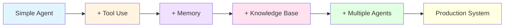

# Agentic AI Architecture Diagrams

Comprehensive architecture diagrams and visual explanations for the 30-day Agentic AI learning path.

## Overview

This folder contains detailed Mermaid diagrams illustrating the architecture, workflows, and patterns covered in the course. Each file corresponds to a day in the curriculum and provides visual representations to deepen understanding.

## Architecture Index

### Week 1: Foundations

| Day | Topic | Key Diagrams |
|-----|-------|--------------|
| [Day 1](./day-01-agent-fundamentals.md) | Agent Fundamentals | Agent Loop, Agent vs Chatbot, Component Architecture, Autonomy Levels |
| [Day 4](./day-04-function-calling.md) | Function Calling & Tool Use | Function Call Flow, Tool Registry, Multi-Tool Execution, Tool States |
| [Day 6](./day-06-agent-patterns.md) | Agent Architecture Patterns | ReAct, Plan-Execute, Reflection, Hierarchical, Pattern Comparison |

### Week 2: Core Capabilities

| Day | Topic | Key Diagrams |
|-----|-------|--------------|
| [Day 8](./day-08-react-pattern.md) | ReAct Pattern | ReAct Loop, State Machine, Execution Trace, Error Recovery |
| [Day 9](./day-09-memory-systems.md) | Memory Systems | Memory Hierarchy, Short/Long-term Memory, Semantic Memory, Retrieval Strategies |
| [Day 11](./day-11-rag.md) | RAG Architecture | RAG Pipeline, Chunking Strategies, Vector Search, Hybrid Search, Re-ranking |

### Week 3: Advanced Systems

| Day | Topic | Key Diagrams |
|-----|-------|--------------|
| [Day 15](./day-15-multi-agent.md) | Multi-Agent Systems | Hierarchical Pattern, Peer-to-Peer, Pipeline, Message Bus, Task Allocation |

### Week 4: Production

| Day | Topic | Key Diagrams |
|-----|-------|--------------|
| [Day 22](./day-22-deployment.md) | Production Deployment | Deployment Architecture, Docker/K8s, Auto-scaling, CI/CD, Monitoring Stack |

## Diagram Types

### 🔄 Flow Diagrams
- Workflow and process flows
- Sequential execution paths
- Decision trees

### 📊 Architecture Diagrams
- System components and relationships
- Hierarchical structures
- Communication patterns

### 🔀 Sequence Diagrams
- Interaction between components
- Message passing
- Temporal relationships

### 📈 State Machines
- State transitions
- Lifecycle management
- Status tracking

### 🧠 Mind Maps
- Conceptual relationships
- Best practices
- Design principles

## How to Use These Diagrams

### 1. Learning Aid
- Review diagrams before reading the day's content
- Use as a visual summary after completing exercises
- Reference when implementing concepts

### 2. Reference Material
- Quick lookup for architecture patterns
- Template for your own implementations
- Comparison between different approaches

### 3. Presentation
- Use in your own presentations
- Share with team members
- Include in documentation

## Viewing Diagrams

All diagrams are created using [Mermaid](https://mermaid.js.org/), which renders in:
- GitHub (native support)
- VS Code (with Mermaid extension)
- Many markdown viewers

**VS Code Extension**: Install "Markdown Preview Mermaid Support" for inline viewing.

## Quick Links to Key Architectures

### Fundamental Concepts
- [Agent Core Loop](./day-01-agent-fundamentals.md#core-agent-architecture) - Understanding the basic agent cycle
- [Function Calling Flow](./day-04-function-calling.md#complete-function-calling-process) - How agents use tools
- [Agent Patterns Overview](./day-06-agent-patterns.md#agent-pattern-comparison) - Different architectural approaches

### Critical Patterns
- [ReAct Pattern](./day-08-react-pattern.md#react-core-loop) - Most popular agent pattern
- [Memory Architecture](./day-09-memory-systems.md#memory-hierarchy) - How agents remember
- [RAG Pipeline](./day-11-rag.md#rag-complete-pipeline) - Knowledge retrieval system

### Advanced Topics
- [Multi-Agent System](./day-15-multi-agent.md#multi-agent-system-overview) - Agent collaboration
- [Production Deployment](./day-22-deployment.md#deployment-architecture-overview) - Going to production

## Architecture Evolution Path

## Diagram Legend

### Common Symbols

| Symbol | Meaning |
|--------|---------|
| Rectangle | Component/Service |
| Diamond | Decision Point |
| Cylinder | Database/Storage |
| Circle | Start/End Point |
| Arrow → | Data/Control Flow |
| Dashed Arrow -.-> | Optional/Async Flow |
| Subgraph | Logical Grouping |

### Color Coding

| Color | Represents |
|-------|-----------|
| Blue (#4a90e2) | Core Components |
| Green (#7ed321) | Success States |
| Red (#ff6b6b) | Error States |
| Yellow (#f9ca24) | Processing/Intermediate |
| Purple (#6c5ce7) | Orchestration/Control |

## Related Resources

- [Main Course README](../README.md) - Back to course overview
- [Day-wise Content](../agentic-ai/) - Detailed daily content
- [Mermaid Documentation](https://mermaid.js.org/intro/) - Learn Mermaid syntax

## Contributing

Found an issue with a diagram or have a suggestion for improvement? These diagrams are designed to help learners visualize complex concepts - feedback is welcome!

## Navigation

- [📚 Back to Main Course](../README.md)
- [📖 Day-by-Day Content](../agentic-ai/)
- [🚀 Get Started with Day 1](../agentic-ai/day-01.md)

---

**Total Architecture Files**: 7 comprehensive architecture guides covering 20+ major diagrams

**Last Updated**: 2024

**License**: Educational use - part of the Agentic AI 30-Day Learning Path
