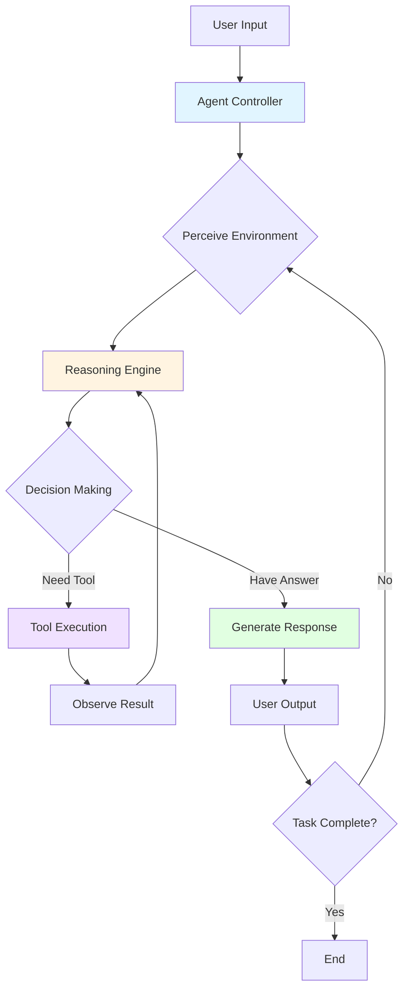
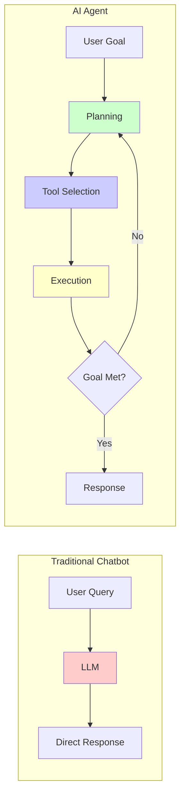
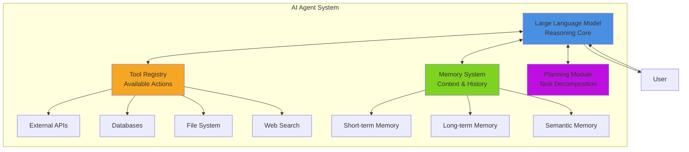
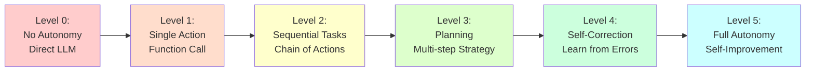
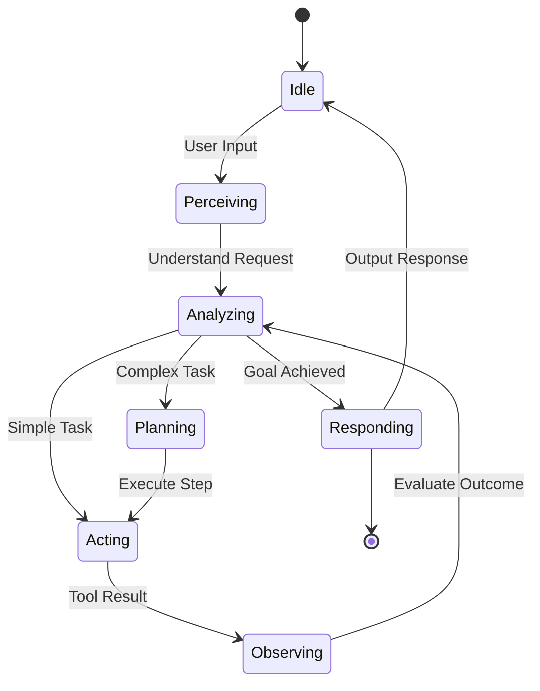
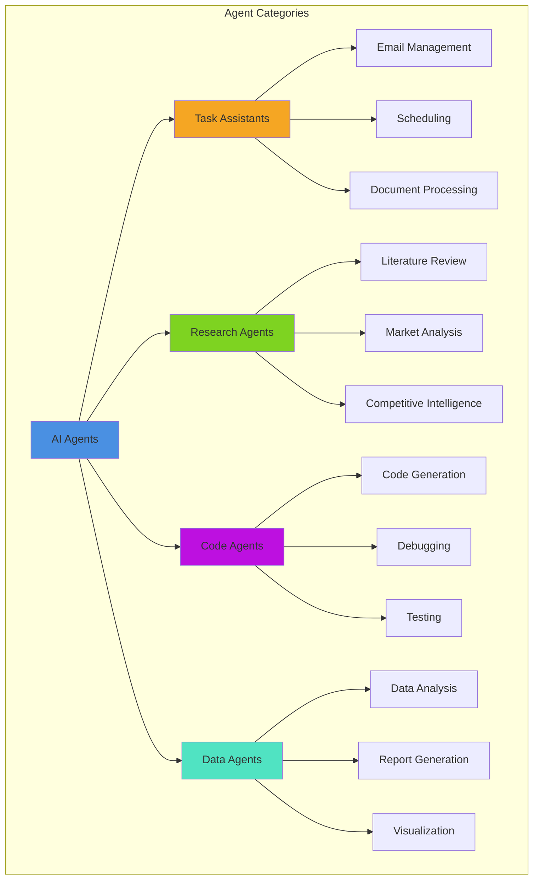
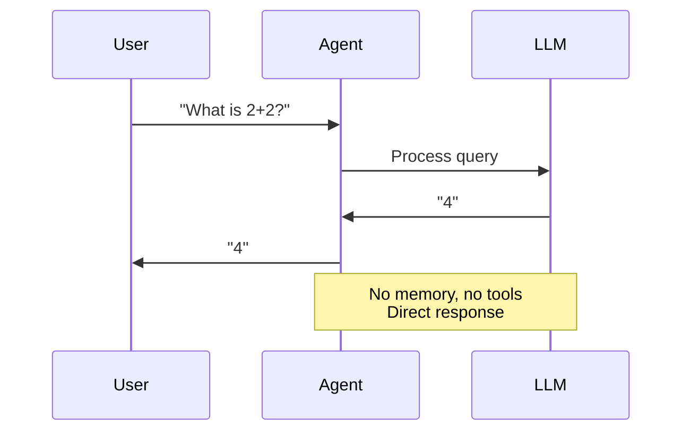
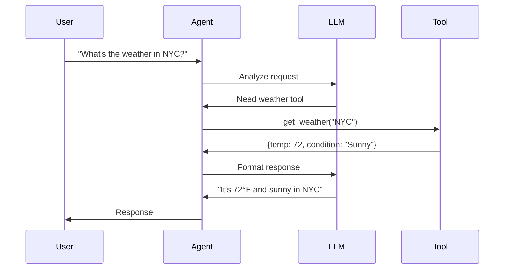
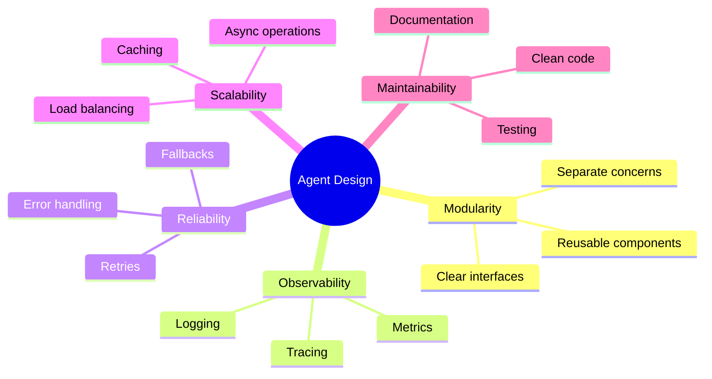

# Day 1: Agent Architecture Fundamentals

## Core Agent Architecture

### Basic Agent Loop

### Agent vs Chatbot Comparison

### Agent Components

### Autonomy Levels

## Key Characteristics

### Agent Decision Flow

## Real-World Agent Types

## Agent Execution Patterns

### Simple Reflex Agent

### Tool-Using Agent

## Related Topics

- **Day 2**: LLM integration (the reasoning core)
- **Day 4**: Tool use implementation
- **Day 6**: Detailed agent patterns
- **Day 9**: Memory systems
- **Day 10**: Planning algorithms

## Architecture Principles

---

**Related Days**: [Day 2](./day-02-llm-apis.md) | [Day 4](./day-04-function-calling.md) | [Day 6](./day-06-agent-patterns.md)
