# Day 4: Function Calling & Tool Use Architecture

## Function Calling Flow

### Complete Function Calling Process

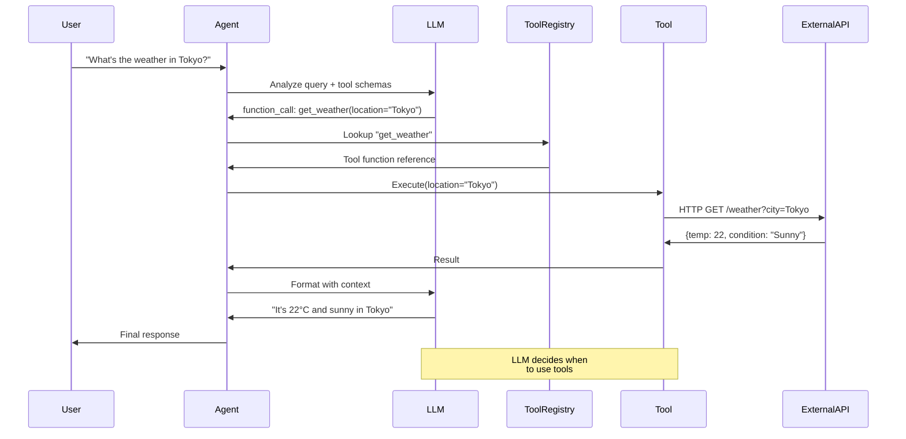

## Tool Registry Architecture

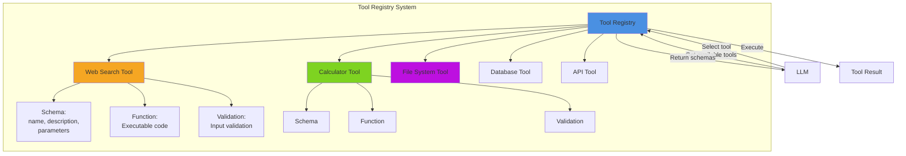

## Tool Schema Structure

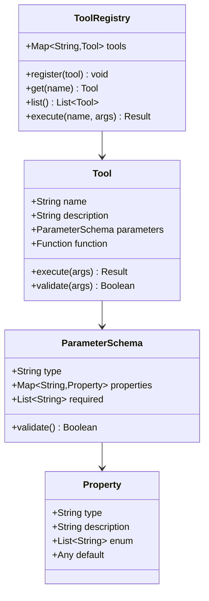

## Multi-Tool Execution Flow

```mermaid
graph TD
    A[User Query:<br/>"Research Python and<br/>calculate market size"] --> B[LLM Analysis]
    B --> C{Plan Required Tools}

    C --> D1[Tool 1: Web Search<br/>search Python market]
    C --> D2[Tool 2: Extract Data<br/>parse results]
    C --> D3[Tool 3: Calculate<br/>compute statistics]

    D1 --> E1[Result 1:<br/>Market data]
    D2 --> E2[Result 2:<br/>Structured data]
    D3 --> E3[Result 3:<br/>Calculations]

    E1 --> F[Combine Results]
    E2 --> F
    E3 --> F

    F --> G[LLM Synthesis]
    G --> H[Final Response]

    style B fill:#4a90e2
    style C fill:#f5a623
    style F fill:#7ed321
    style G fill:#bd10e0
```

## Tool Execution States

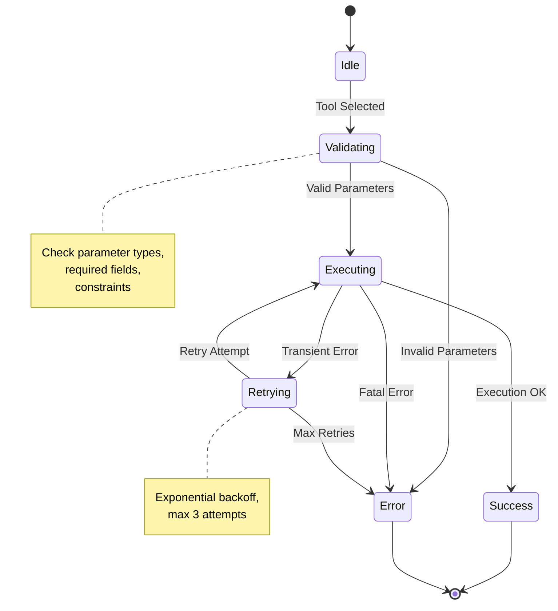

## Tool Communication Patterns

### Synchronous Tool Execution

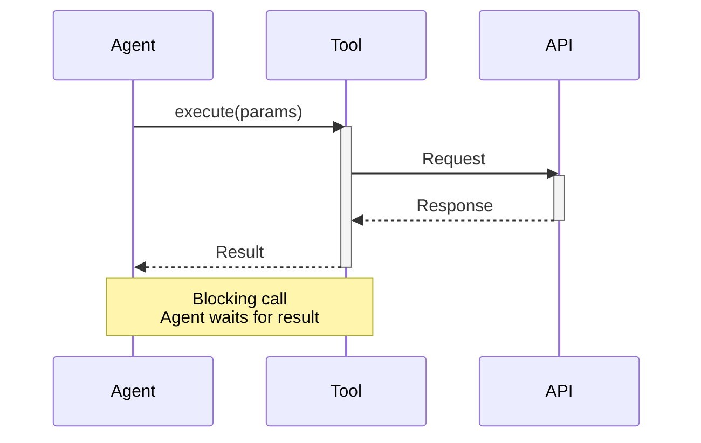

### Asynchronous Tool Execution

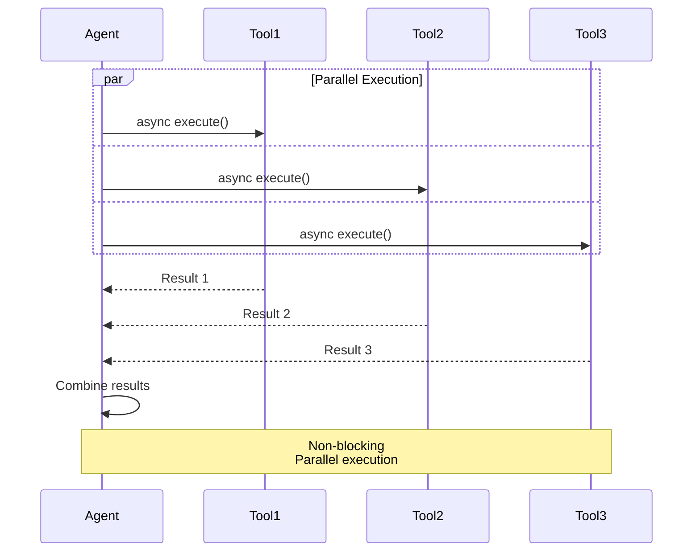

## Error Handling Architecture

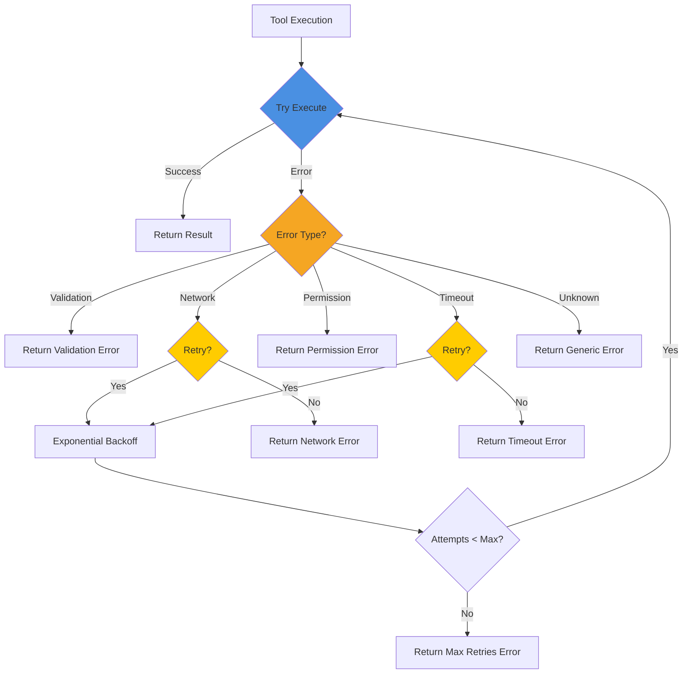

## Tool Library Organization

```mermaid
graph TB
    subgraph "Tool Library"
        direction TB

        CAT1[Search Tools]
        CAT2[Data Tools]
        CAT3[File Tools]
        CAT4[Communication Tools]
        CAT5[Computation Tools]

        CAT1 --> T1A[Web Search]
        CAT1 --> T1B[Knowledge Base Search]
        CAT1 --> T1C[Vector Search]

        CAT2 --> T2A[Database Query]
        CAT2 --> T2B[API Call]
        CAT2 --> T2C[Data Transform]

        CAT3 --> T3A[Read File]
        CAT3 --> T3B[Write File]
        CAT3 --> T3C[List Directory]

        CAT4 --> T4A[Send Email]
        CAT4 --> T4B[Post Slack]
        CAT4 --> T4C[Create Ticket]

        CAT5 --> T5A[Calculator]
        CAT5 --> T5B[Data Analysis]
        CAT5 --> T5C[Code Execution]
    end

    style CAT1 fill:#ff6b6b
    style CAT2 fill:#4ecdc4
    style CAT3 fill:#45b7d1
    style CAT4 fill:#f9ca24
    style CAT5 fill:#6c5ce7
```

## Tool Chain Example

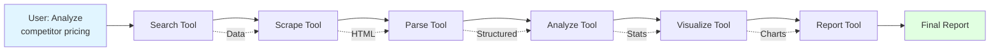

## Function Calling Standards

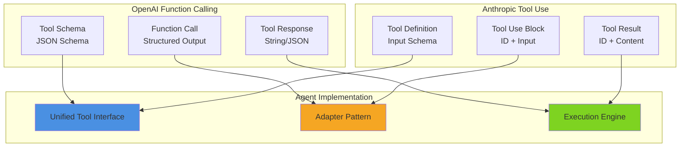

## Related Topics

- **Day 1**: Agent fundamentals (why tools matter)
- **Day 2**: LLM APIs (how LLMs call functions)
- **Day 5**: Building first agent (practical implementation)
- **Day 6**: Agent patterns (tool orchestration)
- **Day 13**: Error handling (robust tool execution)

## Best Practices

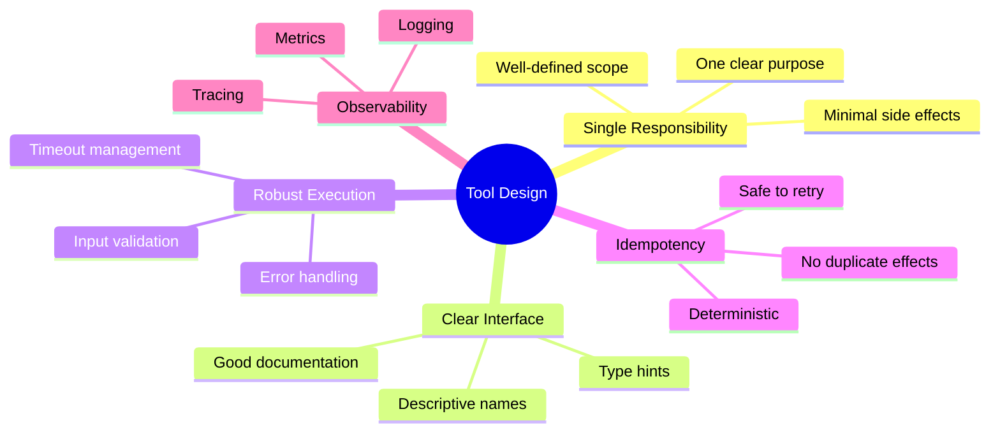

---

**Related Days**: [Day 1](./day-01-agent-fundamentals.md) | [Day 5](./day-05-first-agent.md) | [Day 6](./day-06-agent-patterns.md)
