# Day 6: Agent Architecture Patterns

## Agent Pattern Comparison

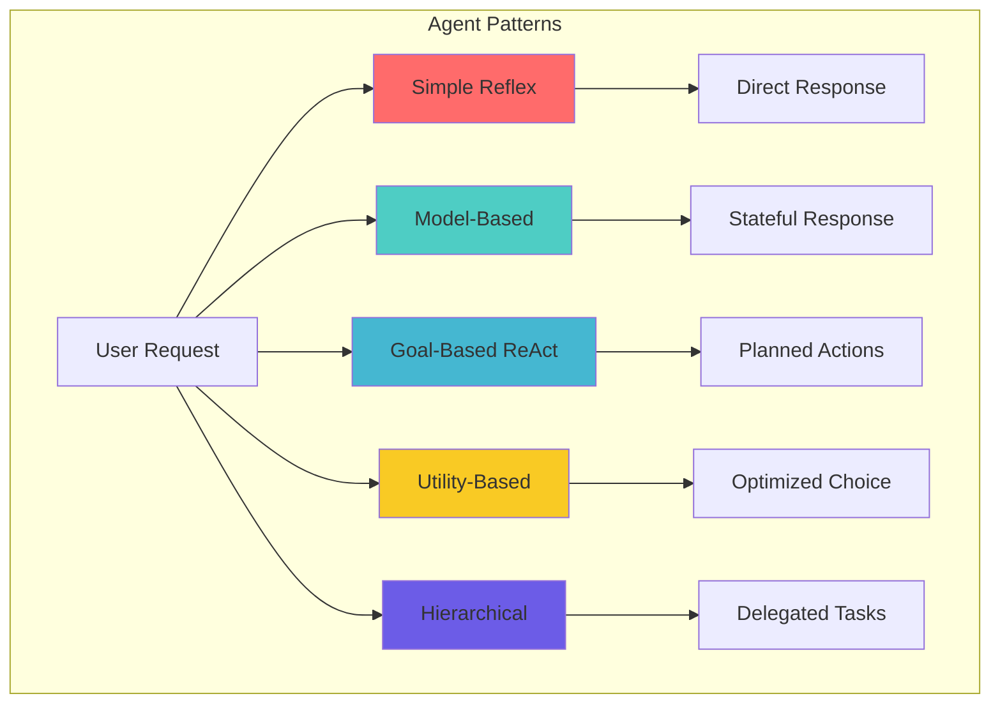

## 1. Simple Reflex Agent

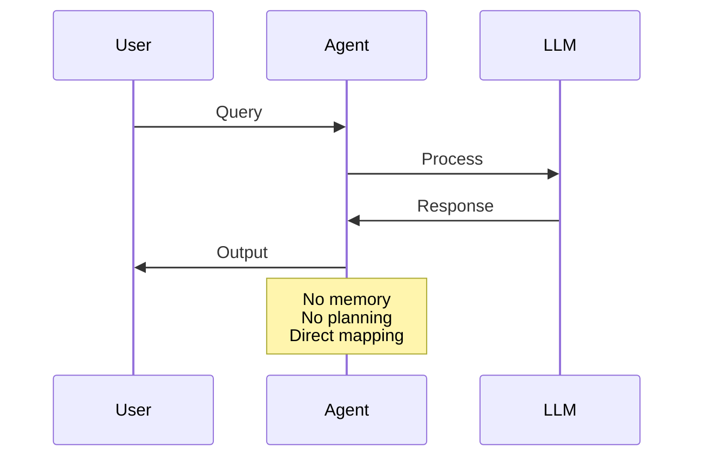

**Architecture:**

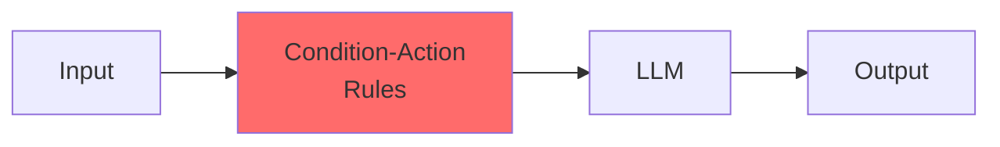

## 2. Model-Based Agent

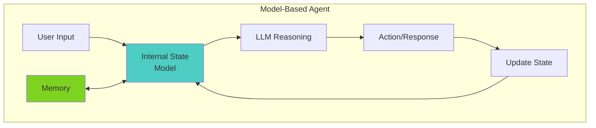

**State Flow:**

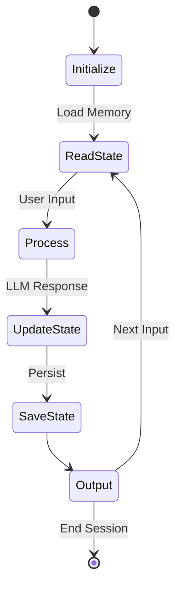

## 3. ReAct (Reasoning + Acting) Pattern

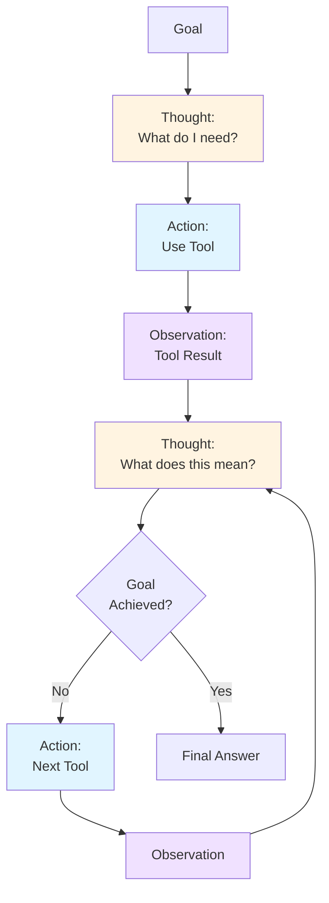

**Detailed ReAct Loop:**

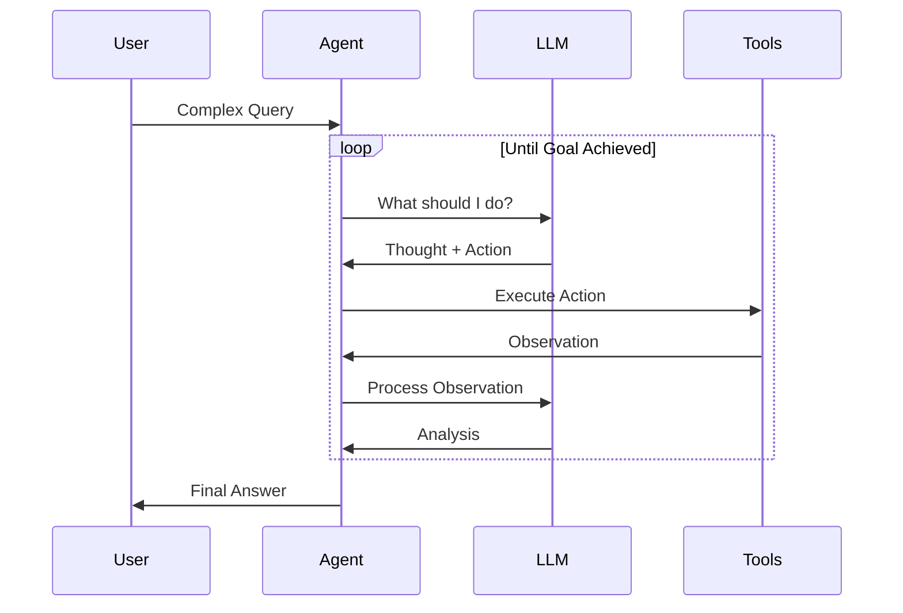

## 4. Plan-and-Execute Pattern

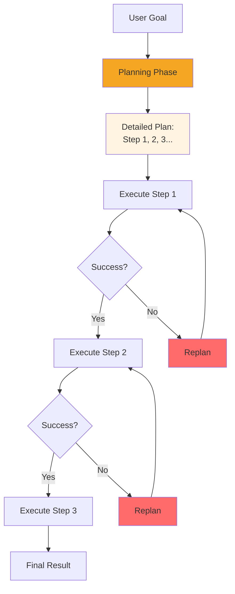

**Plan Structure:**

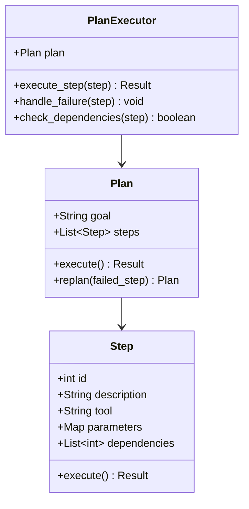

## 5. Reflection Pattern

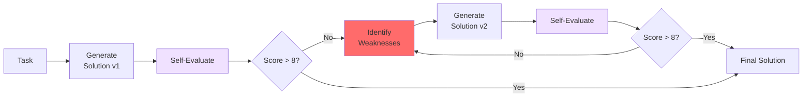

## 6. Hierarchical Agent Pattern

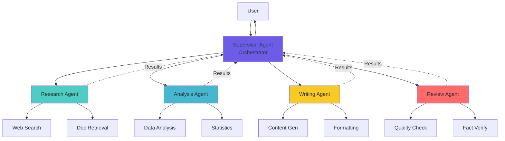

## Pattern Selection Matrix

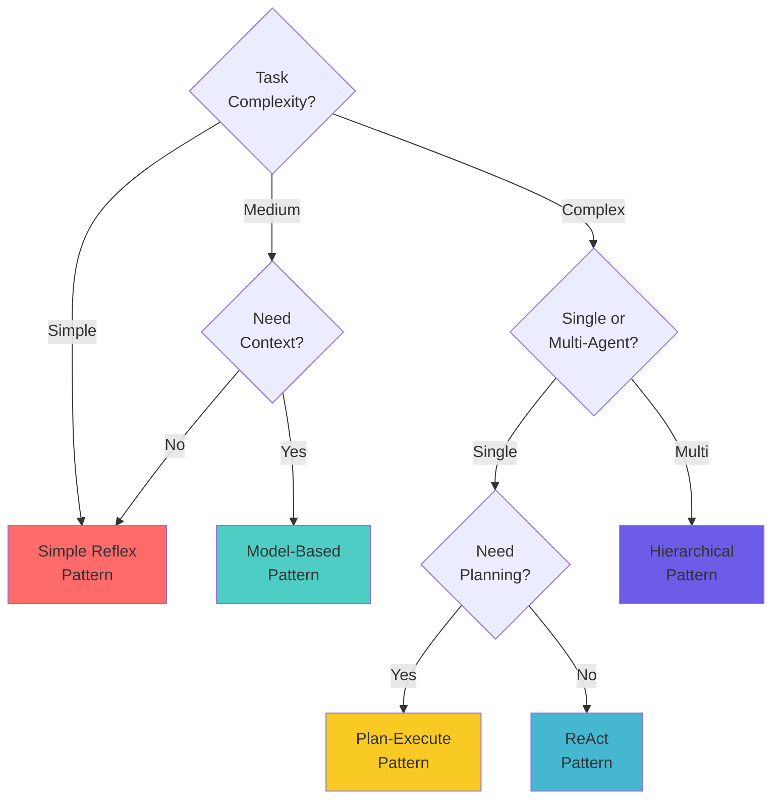

## Hybrid Pattern: ReAct + Planning

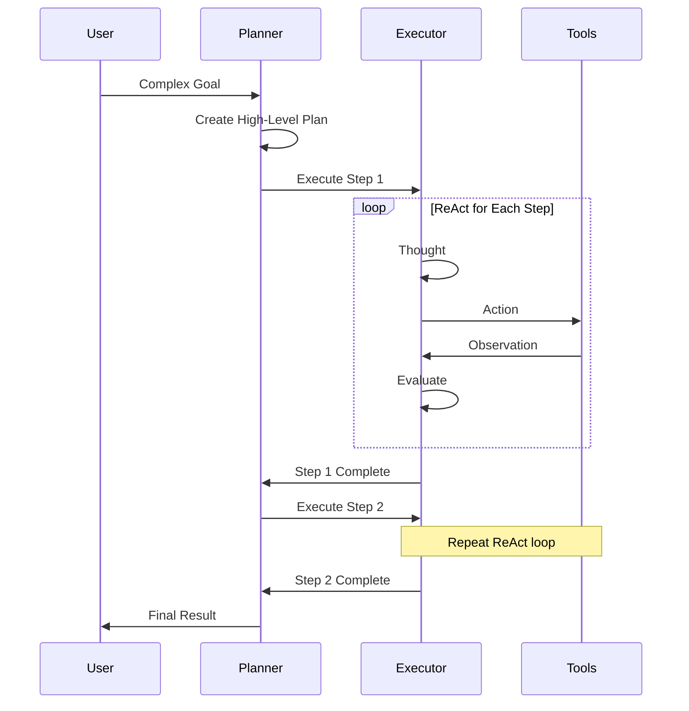

## Agent Pattern Characteristics

```mermaid
graph LR
    subgraph "Pattern Comparison"
        direction TB

        P1[Simple Reflex]
        P2[Model-Based]
        P3[ReAct]
        P4[Plan-Execute]
        P5[Hierarchical]

        P1 -.->|Speed: ⚡⚡⚡| S1
        P1 -.->|Cost: $| C1
        P1 -.->|Reliability: ⭐⭐| R1

        P2 -.->|Speed: ⚡⚡| S2
        P2 -.->|Cost: $$| C2
        P2 -.->|Reliability: ⭐⭐⭐| R2

        P3 -.->|Speed: ⚡| S3
        P3 -.->|Cost: $$$| C3
        P3 -.->|Reliability: ⭐⭐⭐⭐| R3

        P4 -.->|Speed: ⚡| S4
        P4 -.->|Cost: $$$$| C4
        P4 -.->|Reliability: ⭐⭐⭐⭐⭐| R4

        P5 -.->|Speed: ⚡| S5
        P5 -.->|Cost: $$$$$| C5
        P5 -.->|Reliability: ⭐⭐⭐⭐⭐| R5
    end
```

## State Management Across Patterns

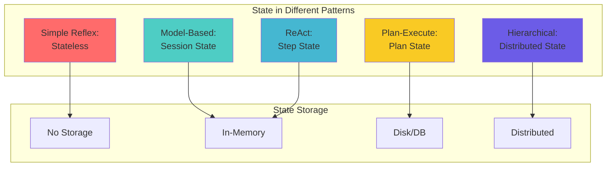

## Related Topics

- **Day 1**: Agent fundamentals
- **Day 4**: Tool use (used in all patterns)
- **Day 8**: ReAct pattern deep dive
- **Day 9**: Memory systems (for Model-Based)
- **Day 10**: Planning (for Plan-Execute)
- **Day 15**: Multi-agent systems (for Hierarchical)

## Pattern Evolution

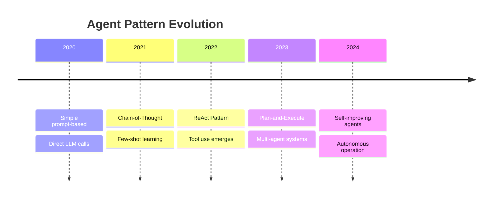

---

**Related Days**: [Day 1](./day-01-agent-fundamentals.md) | [Day 8](./day-08-react-pattern.md) | [Day 10](./day-10-planning.md)
