# Day 8: ReAct Pattern Architecture

## ReAct Core Loop

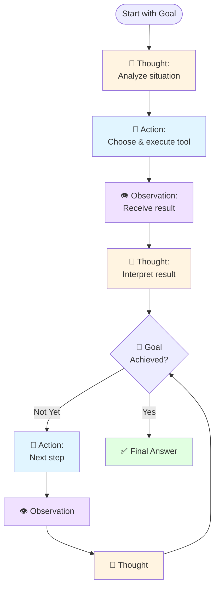

## Complete ReAct Flow with LLM

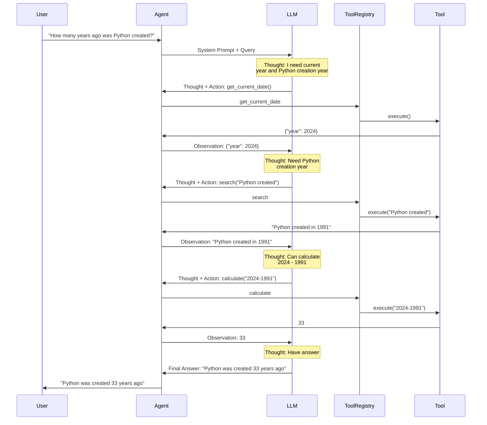

## ReAct State Machine

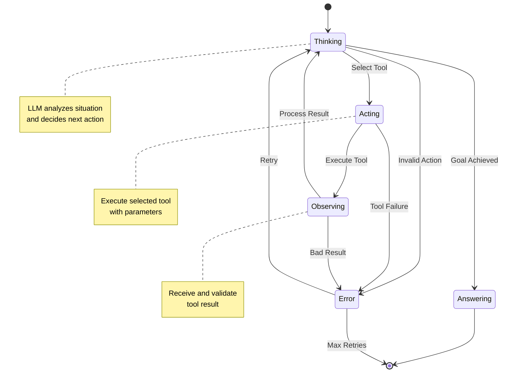

## ReAct Implementation Architecture

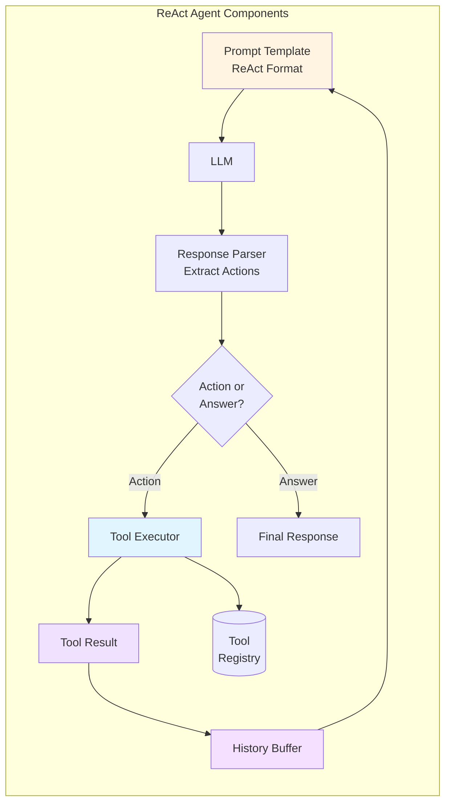

## ReAct Prompt Structure

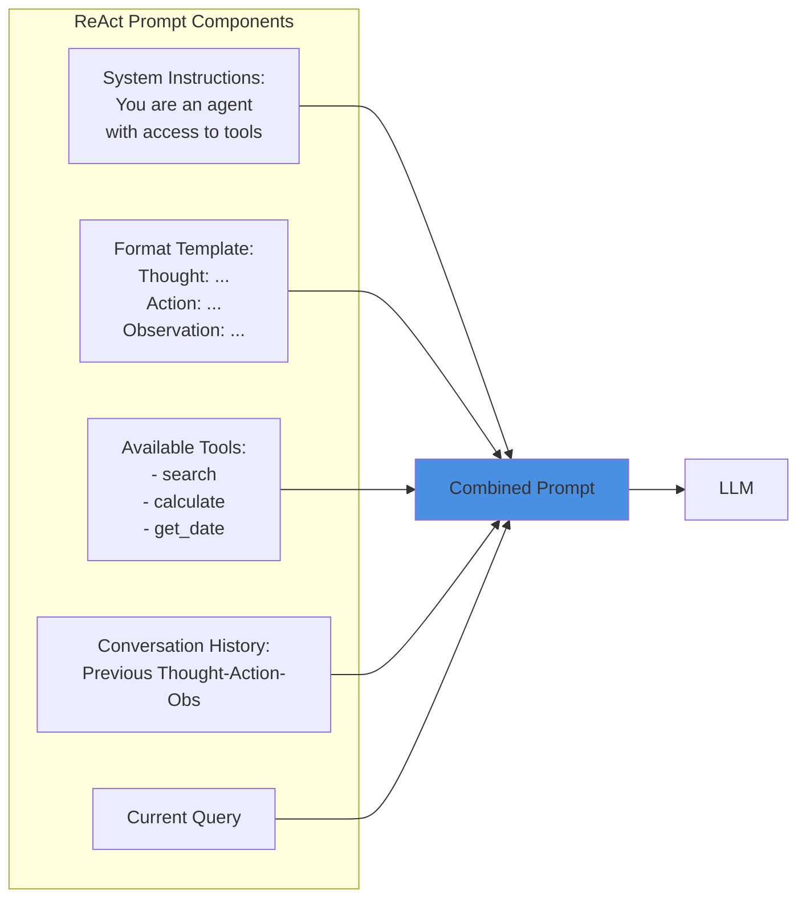

## Loop Detection & Management

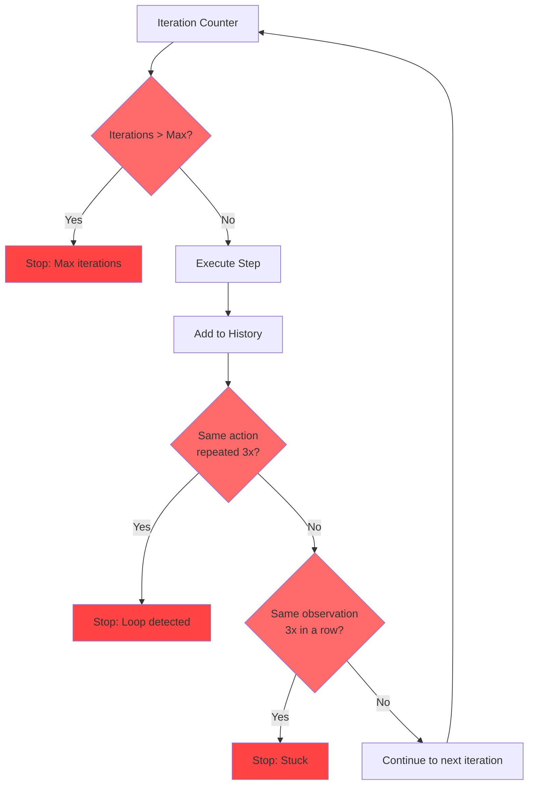

## ReAct with Multiple Tools

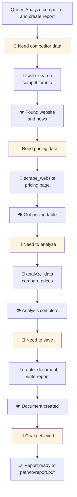

## Error Recovery in ReAct

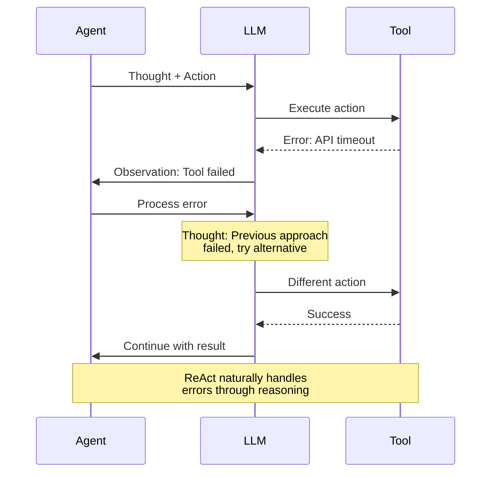

## ReAct Execution Trace

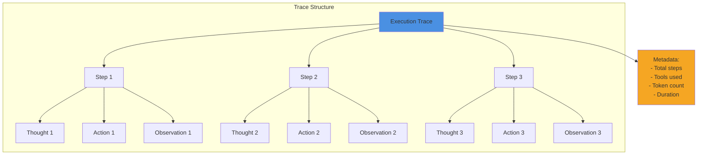

## ReAct vs Other Patterns

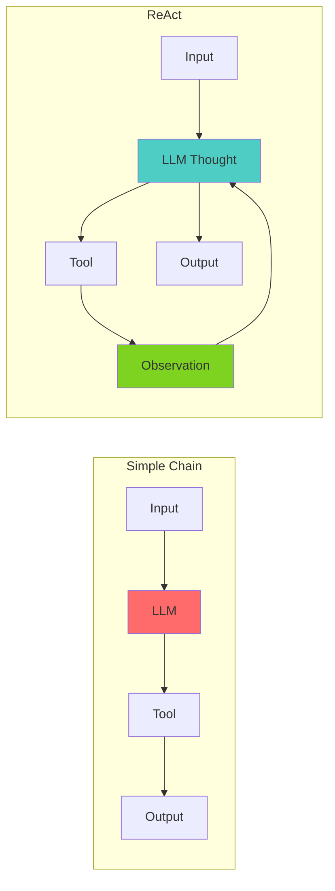

## ReAct Performance Optimization

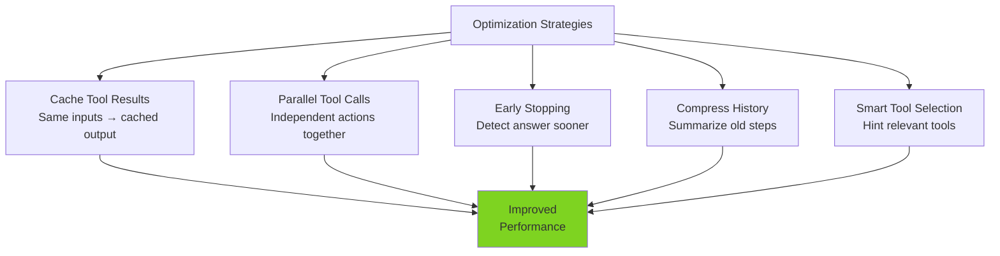

## Advanced ReAct: Self-Correction

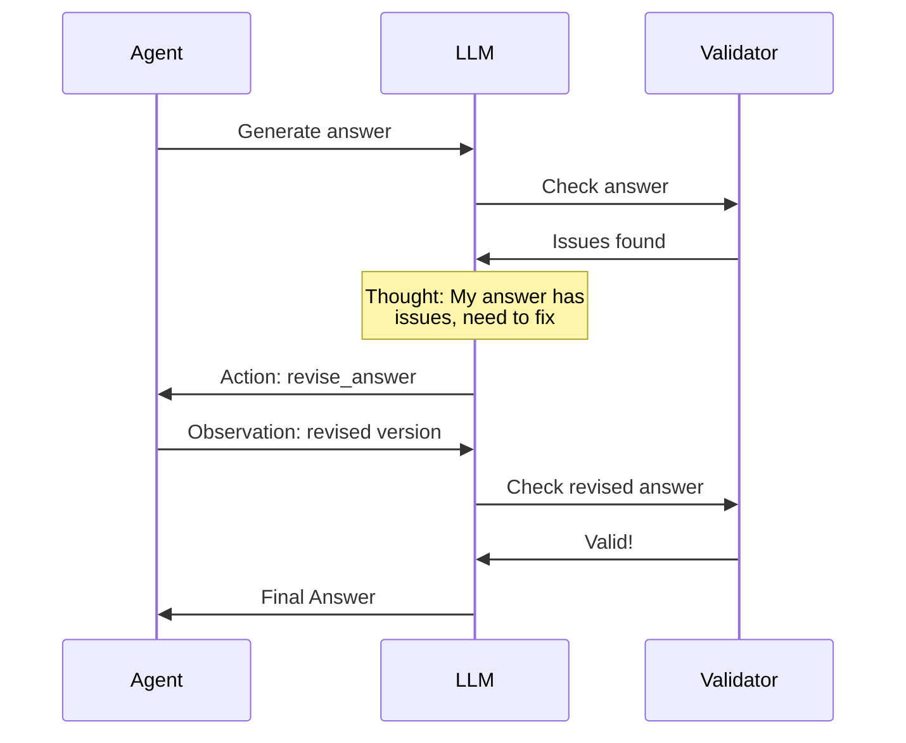

## Related Topics

- **Day 1**: Agent fundamentals (basic loop)
- **Day 4**: Function calling (tool execution)
- **Day 6**: Agent patterns (ReAct overview)
- **Day 9**: Memory systems (history management)
- **Day 10**: Planning (alternative pattern)
- **Day 13**: Error handling (robustness)

## ReAct Debugging

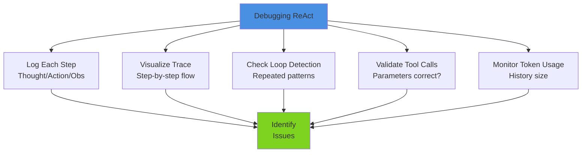

---

**Related Days**: [Day 6](./day-06-agent-patterns.md) | [Day 9](./day-09-memory-systems.md) | [Day 10](./day-10-planning.md)
