# Day 9: Memory Systems Architecture

## Memory Hierarchy

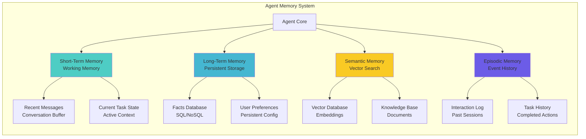

## Short-Term Memory Architecture

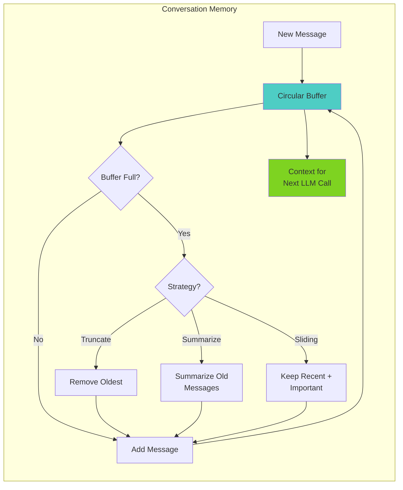

**Memory Window Management:**

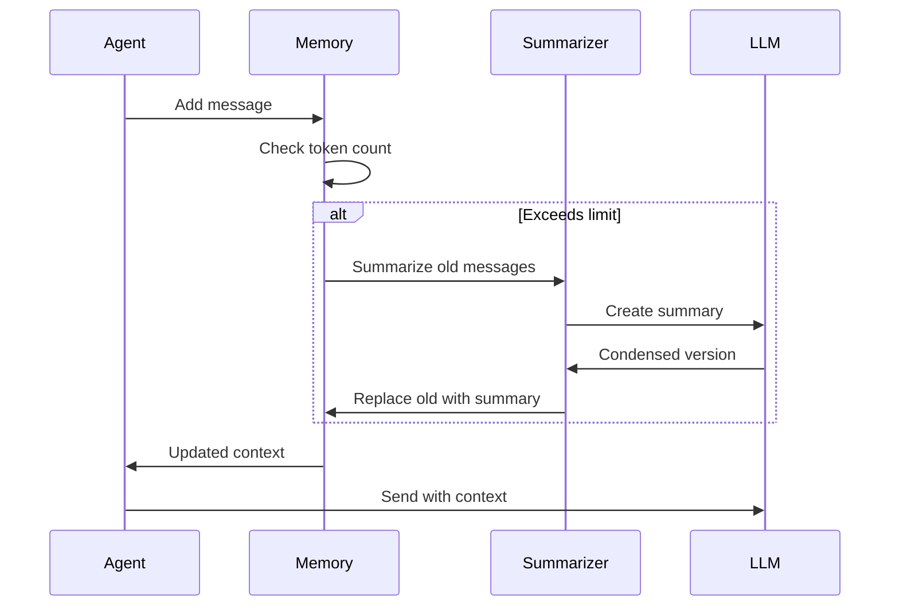

## Long-Term Memory Storage

```mermaid
graph TB
    subgraph "Persistent Memory Architecture"
        direction TB

        FACTS[Facts Table]
        PREFS[Preferences Table]
        HISTORY[History Table]

        FACTS --> F1[Category: user_info<br/>Key: name<br/>Value: John<br/>Confidence: 1.0]

        PREFS --> P1[User: user_123<br/>Key: language<br/>Value: Python<br/>Updated: 2024-01-15]

        HISTORY --> H1[Event: task_complete<br/>Description: API created<br/>Outcome: success<br/>Metadata: {duration: 45min}]
    end

    subgraph "Database Schema"
        direction LR
        DB[(SQLite/PostgreSQL)]

        DB --> T1[facts<br/>id, category, key,<br/>value, confidence,<br/>created_at, updated_at]

        DB --> T2[preferences<br/>id, user_id, key,<br/>value, created_at]

        DB --> T3[experiences<br/>id, event_type,<br/>description, outcome,<br/>metadata, created_at]
    end

    style FACTS fill:#45b7d1
    style PREFS fill:#f9ca24
    style HISTORY fill:#6c5ce7
```

## Semantic Memory with Embeddings

```mermaid
graph TD
    subgraph "Vector Memory System"
        INPUT[New Information] --> EMBED[Create Embedding]
        EMBED --> VECTOR[Vector<br/>[0.23, -0.45, ...]]
        VECTOR --> STORE[Vector Database]

        QUERY[Query] --> QEMBED[Query Embedding]
        QEMBED --> SEARCH[Similarity Search]
        STORE --> SEARCH
        SEARCH --> RESULTS[Top-K Results]

        RESULTS --> RANK[Re-ranking]
        RANK --> CONTEXT[Relevant Context]
    end

    style EMBED fill:#4ecdc4
    style STORE fill:#45b7d1
    style SEARCH fill:#f9ca24
    style RANK fill:#6c5ce7
```

**Embedding Storage Structure:**

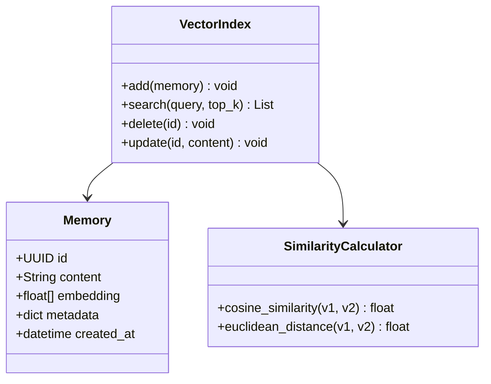

## Episodic Memory Timeline

```mermaid
gantt
    title Agent Interaction History
    dateFormat HH:mm
    section Session 1
    User query about Python    :done, 09:00, 09:02
    Web search executed        :done, 09:02, 09:05
    Response delivered         :done, 09:05, 09:06
    section Session 2
    Follow-up question         :done, 10:30, 10:31
    Database query             :done, 10:31, 10:33
    Analysis complete          :done, 10:33, 10:35
    section Session 3
    New task started           :active, 14:00, 14:05
    Code generation            :14:05, 14:10
```

## Integrated Memory Access

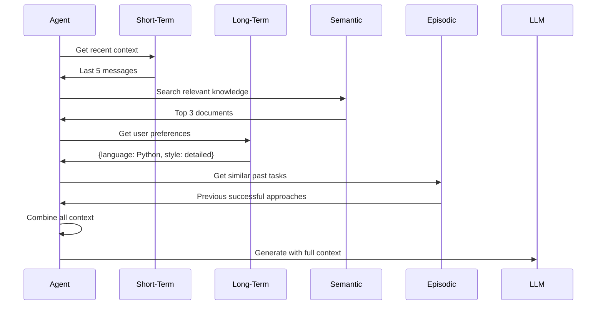

## Memory Retrieval Strategies

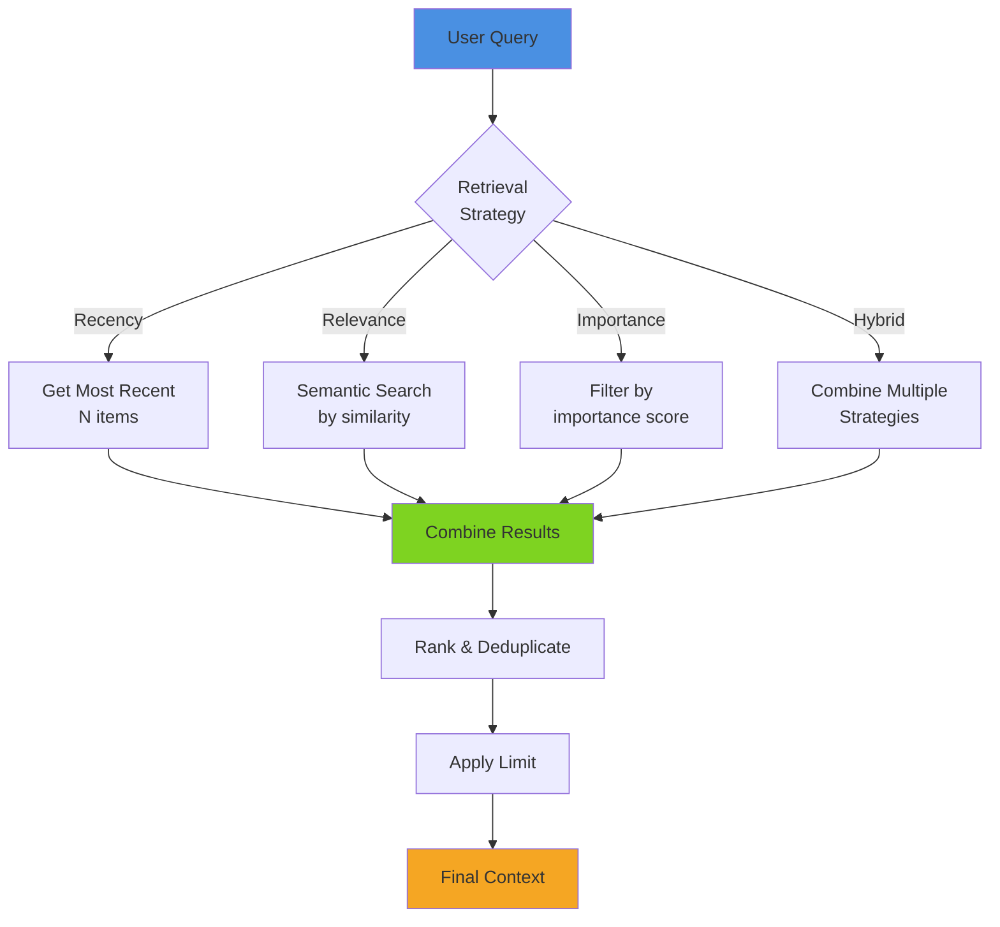

## Memory Compression Techniques

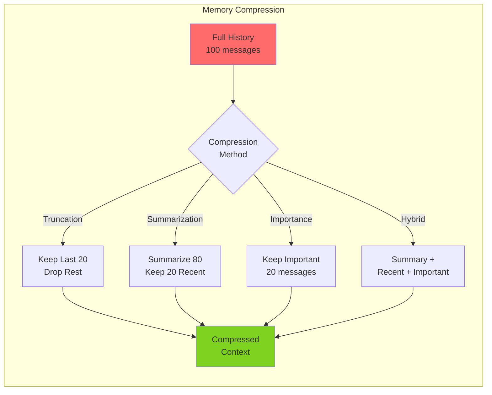

**Summarization Flow:**

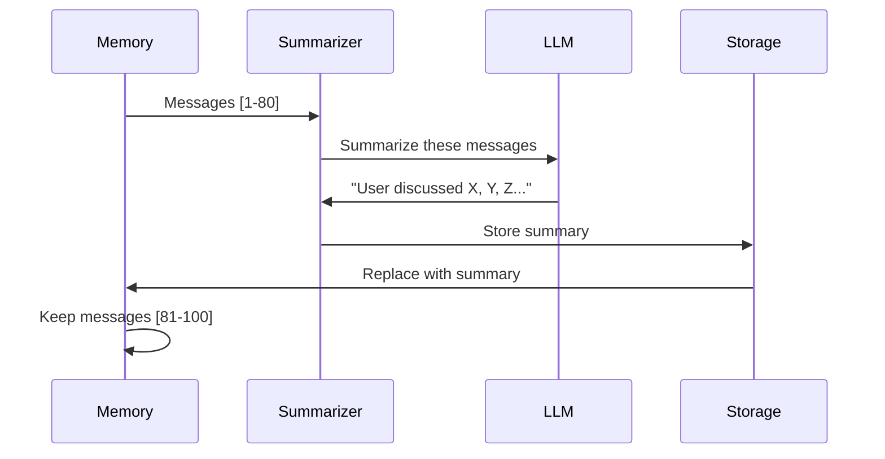

## Memory Lifecycle

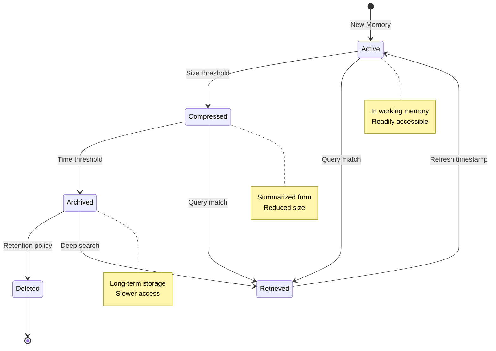

## Memory-Enhanced Agent

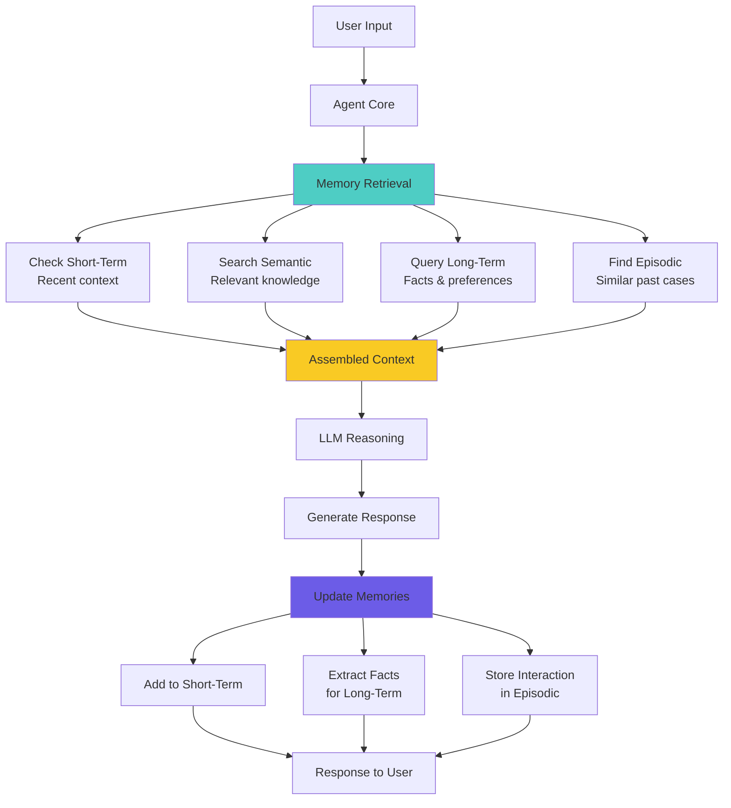

## Memory Performance Optimization

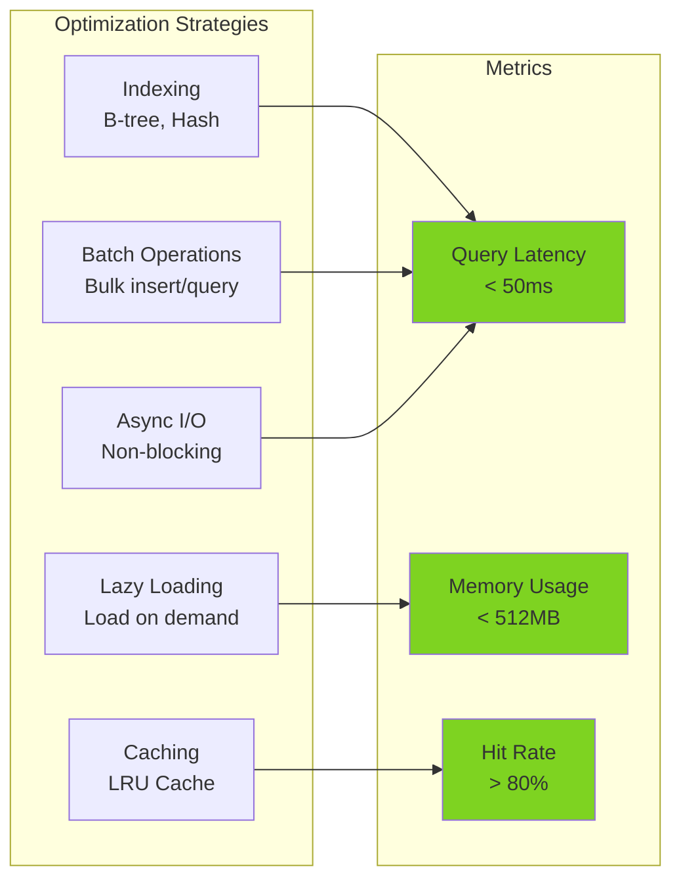

## Related Topics

- **Day 1**: Agent fundamentals (why memory matters)
- **Day 6**: Agent patterns (memory in different patterns)
- **Day 8**: ReAct (history management)
- **Day 11**: RAG (semantic memory overlap)
- **Day 12**: Vector databases (semantic memory implementation)

## Memory Architecture Best Practices

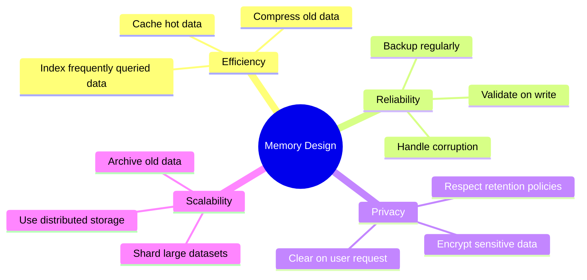

---

**Related Days**: [Day 8](./day-08-react-pattern.md) | [Day 11](./day-11-rag.md) | [Day 12](./day-12-vector-databases.md)
