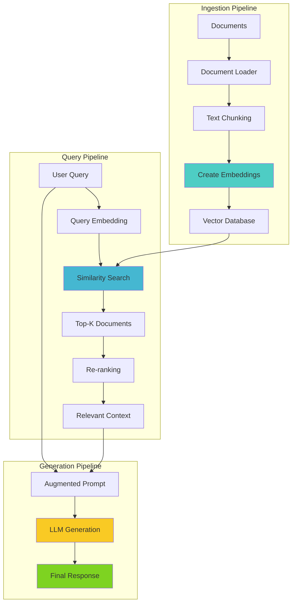
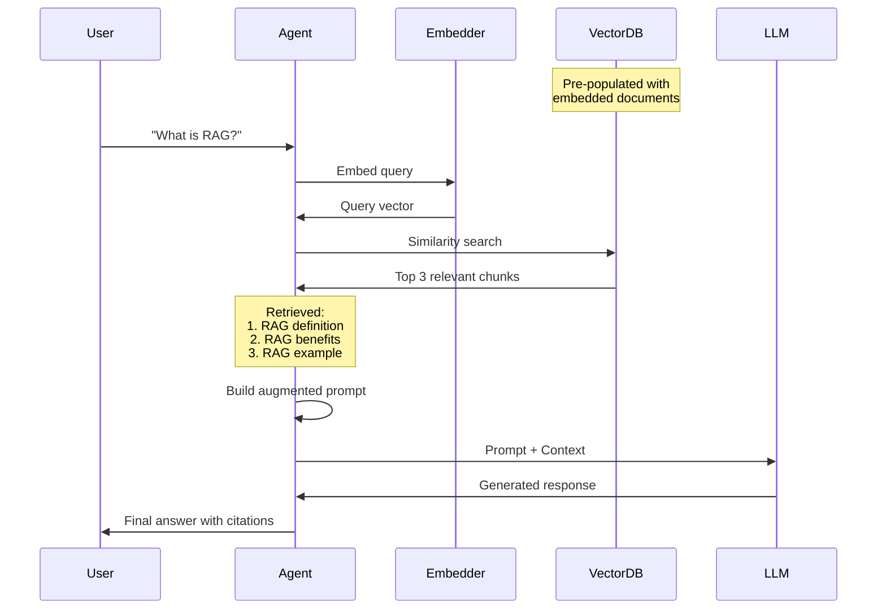
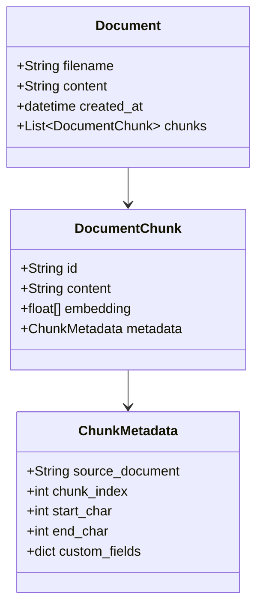
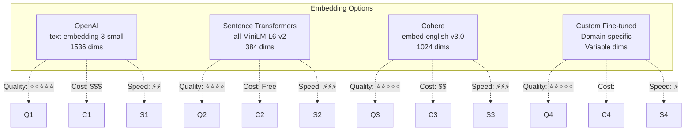
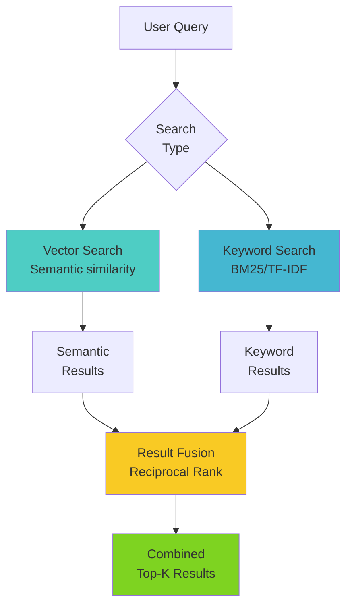
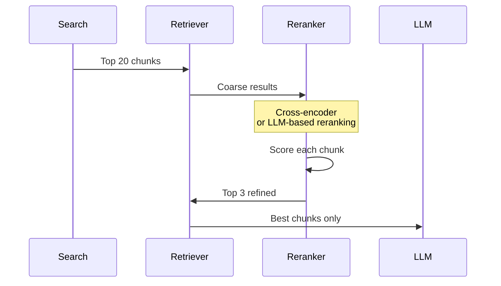
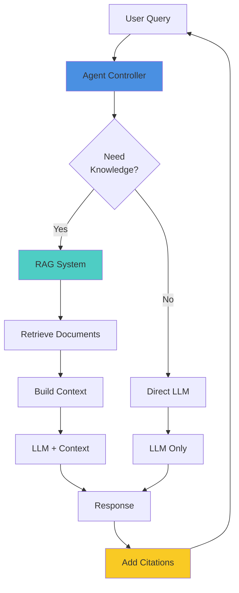
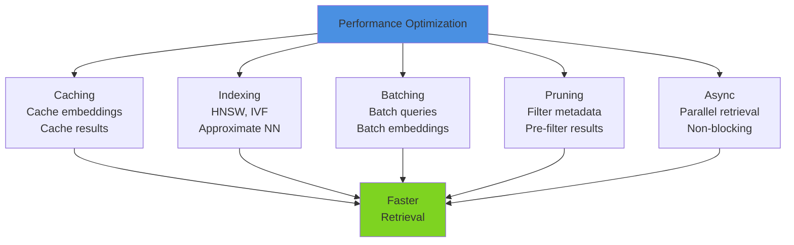
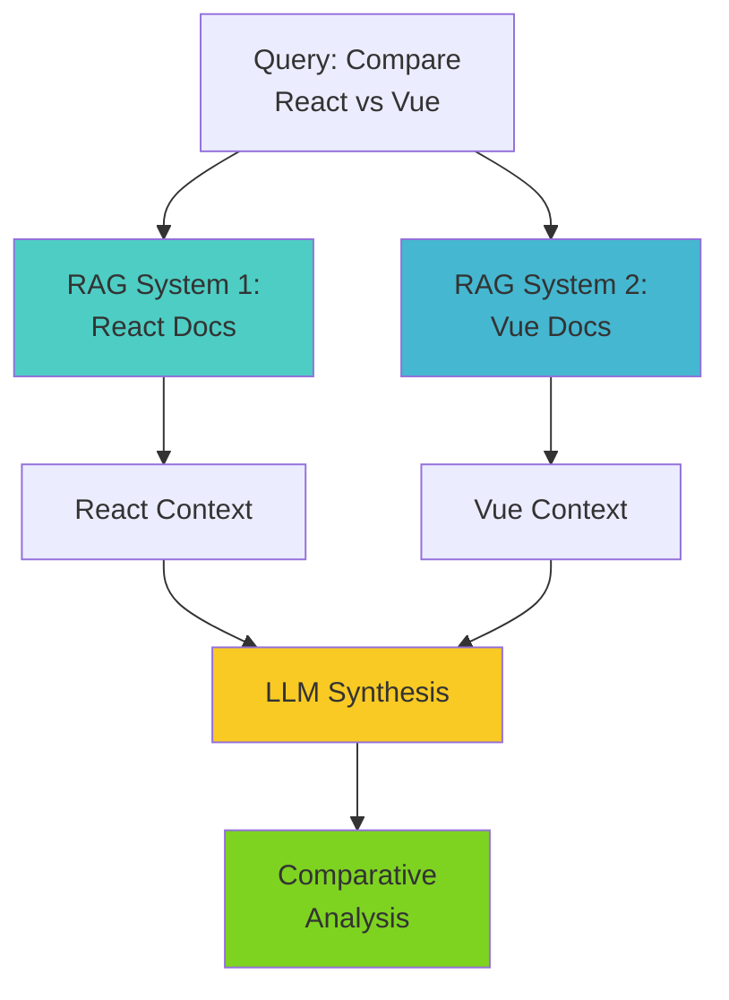
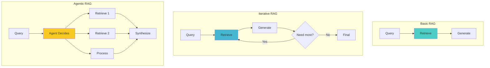

# Day 11: RAG (Retrieval Augmented Generation) Architecture

## RAG Complete Pipeline



## RAG Workflow Detailed



## Document Chunking Strategies

```mermaid
graph TB
    DOC[Long Document] --> STRATEGY{Chunking<br/>Strategy}

    STRATEGY -->|Fixed Size| FIXED[Split every<br/>500 tokens]
    STRATEGY -->|Semantic| SEMANTIC[Split by<br/>paragraphs/sections]
    STRATEGY -->|Recursive| RECURSIVE[Split recursively<br/>until size met]
    STRATEGY -->|Overlap| OVERLAP[Sliding window<br/>with overlap]

    FIXED --> CHUNKS1[Chunk 1<br/>Chunk 2<br/>Chunk 3]
    SEMANTIC --> CHUNKS2[Intro<br/>Method<br/>Results]
    RECURSIVE --> CHUNKS3[Section → Para<br/>→ Sentence]
    OVERLAP --> CHUNKS4[Chunk 1: [0-500]<br/>Chunk 2: [400-900]<br/>Chunk 3: [800-1300]]

    style STRATEGY fill:#4a90e2
    style CHUNKS1 fill:#4ecdc4
    style CHUNKS2 fill:#45b7d1
    style CHUNKS3 fill:#f9ca24
    style CHUNKS4 fill:#6c5ce7
```

**Chunk Metadata Structure:**



## Vector Search Architecture

```mermaid
graph LR
    subgraph "Search Process"
        Q[Query:<br/>"Python web frameworks"] --> E[Embedding<br/>Model]
        E --> V[Query Vector<br/>[0.12, -0.34, ...]]

        V --> INDEX[Vector Index<br/>HNSW/IVF]

        INDEX --> S1[Similarity:<br/>Django chunk<br/>0.92]
        INDEX --> S2[Similarity:<br/>Flask chunk<br/>0.89]
        INDEX --> S3[Similarity:<br/>FastAPI chunk<br/>0.87]

        S1 --> RESULTS[Top-K<br/>Results]
        S2 --> RESULTS
        S3 --> RESULTS
    end

    style E fill:#4ecdc4
    style INDEX fill:#45b7d1
    style RESULTS fill:#7ed321
```

## Embedding Models Comparison



## Hybrid Search Architecture



## Re-ranking Pipeline



## RAG with Agent Integration



## Advanced RAG: Query Transformation

```mermaid
graph LR
    Q[Original Query:<br/>"What are the latest AI trends?"] --> T{Transform}

    T --> T1[Decompose:<br/>"AI trends in 2024"<br/>"Recent AI breakthroughs"<br/>"Emerging AI tech"]

    T --> T2[Expand:<br/>Add synonyms<br/>Add related terms]

    T --> T3[Rewrite:<br/>"Recent developments<br/>in artificial intelligence"]

    T1 --> SEARCH[Multiple Searches]
    T2 --> SEARCH
    T3 --> SEARCH

    SEARCH --> COMBINE[Combine Results]

    style T fill:#4a90e2
    style COMBINE fill:#7ed321
```

## RAG Performance Optimization



## RAG Evaluation Metrics

```mermaid
graph LR
    subgraph "Retrieval Metrics"
        R1[Recall@K:<br/>Relevant docs<br/>in top K]
        R2[Precision@K:<br/>% relevant<br/>in top K]
        R3[MRR:<br/>Mean reciprocal<br/>rank]
    end

    subgraph "Generation Metrics"
        G1[Faithfulness:<br/>Response grounded<br/>in context?]
        G2[Relevance:<br/>Answers the<br/>question?]
        G3[Citation Accuracy:<br/>Correct source<br/>attribution?]
    end

    R1 --> EVAL[Overall<br/>RAG Quality]
    R2 --> EVAL
    R3 --> EVAL
    G1 --> EVAL
    G2 --> EVAL
    G3 --> EVAL

    style EVAL fill:#7ed321
```

## Multi-Document RAG



## RAG Error Handling

```mermaid
stateDiagram-v2
    [*] --> Query
    Query --> Embed: Create embedding
    Embed --> Search: Vector search
    Search --> CheckResults: Evaluate results

    CheckResults --> Generate: Good results
    CheckResults --> Fallback: No/poor results

    Fallback --> Broaden: Expand query
    Fallback --> Rephrase: Rewrite query
    Fallback --> Default: Use base knowledge

    Broaden --> Search
    Rephrase --> Search
    Default --> Generate

    Generate --> Validate: Check quality
    Validate --> Return: Valid
    Validate --> Retry: Invalid
    Retry --> Query

    Return --> [*]
```

## Related Topics

- **Day 9**: Memory systems (semantic memory overlap)
- **Day 12**: Vector databases (storage backend)
- **Day 14**: Research assistant project (RAG application)
- **Day 18**: LangChain (RAG implementation)

## RAG Architecture Patterns



---

**Related Days**: [Day 9](./day-09-memory-systems.md) | [Day 12](./day-12-vector-databases.md) | [Day 18](./day-18-langchain.md)
