# Day 15: Multi-Agent Systems Architecture

## Multi-Agent System Overview

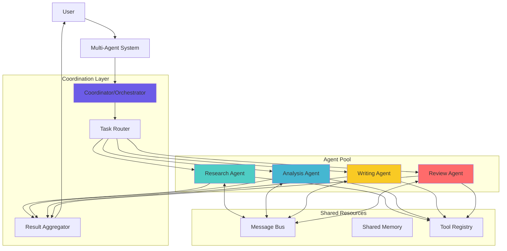
```mermaid
graph TB
    USER[User] --> SYSTEM[Multi-Agent System]

    subgraph "Coordination Layer"
        COORDINATOR[Coordinator/Orchestrator]
        ROUTER[Task Router]
        AGGREGATOR[Result Aggregator]
    end

    subgraph "Agent Pool"
        A1[Research Agent]
        A2[Analysis Agent]
        A3[Writing Agent]
        A4[Review Agent]
    end

    subgraph "Shared Resources"
        MSG[Message Bus]
        MEM[Shared Memory]
        TOOLS[Tool Registry]
    end

    SYSTEM --> COORDINATOR
    COORDINATOR --> ROUTER
    ROUTER --> A1
    ROUTER --> A2
    ROUTER --> A3
    ROUTER --> A4

    A1 --> AGGREGATOR
    A2 --> AGGREGATOR
    A3 --> AGGREGATOR
    A4 --> AGGREGATOR

    A1 <--> MSG
    A2 <--> MSG
    A3 <--> MSG
    A4 <--> MSG

    A1 --> TOOLS
    A2 --> TOOLS
    A3 --> TOOLS
    A4 --> TOOLS

    AGGREGATOR --> USER

    style COORDINATOR fill:#6c5ce7
    style A1 fill:#4ecdc4
    style A2 fill:#45b7d1
    style A3 fill:#f9ca24
    style A4 fill:#ff6b6b
```

## Architecture Patterns

### 1. Hierarchical Pattern (Supervisor-Worker)

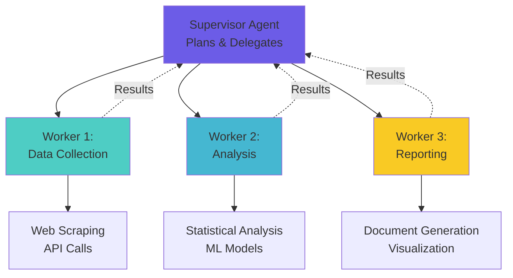
```mermaid
graph TD
    SUPER[Supervisor Agent<br/>Plans & Delegates] --> W1[Worker 1:<br/>Data Collection]
    SUPER --> W2[Worker 2:<br/>Analysis]
    SUPER --> W3[Worker 3:<br/>Reporting]

    W1 --> T1[Web Scraping<br/>API Calls]
    W2 --> T2[Statistical Analysis<br/>ML Models]
    W3 --> T3[Document Generation<br/>Visualization]

    W1 -.->|Results| SUPER
    W2 -.->|Results| SUPER
    W3 -.->|Results| SUPER

    style SUPER fill:#6c5ce7
    style W1 fill:#4ecdc4
    style W2 fill:#45b7d1
    style W3 fill:#f9ca24
```

**Delegation Flow:**

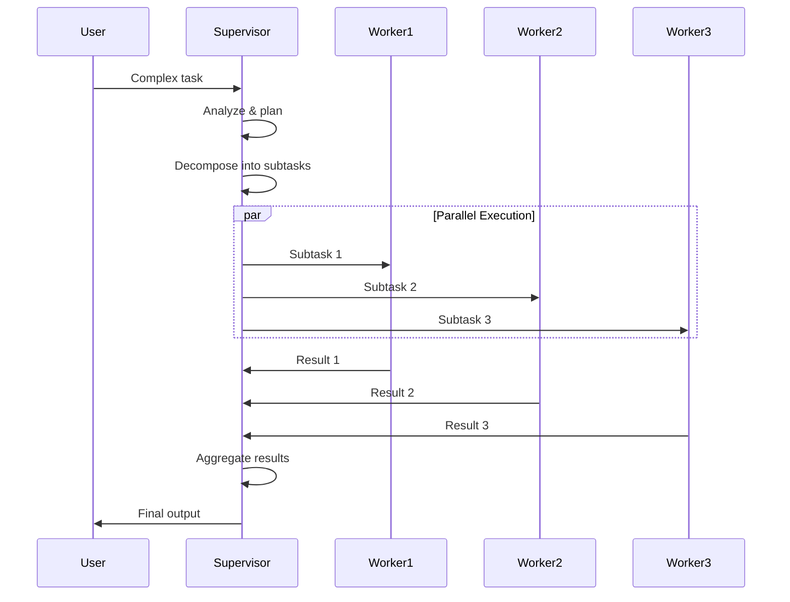
```mermaid
sequenceDiagram
    participant User
    participant Supervisor
    participant Worker1
    participant Worker2
    participant Worker3

    User->>Supervisor: Complex task
    Supervisor->>Supervisor: Analyze & plan
    Supervisor->>Supervisor: Decompose into subtasks

    par Parallel Execution
        Supervisor->>Worker1: Subtask 1
        Supervisor->>Worker2: Subtask 2
        Supervisor->>Worker3: Subtask 3
    end

    Worker1->>Supervisor: Result 1
    Worker2->>Supervisor: Result 2
    Worker3->>Supervisor: Result 3

    Supervisor->>Supervisor: Aggregate results
    Supervisor->>User: Final output
```

### 2. Peer-to-Peer Pattern

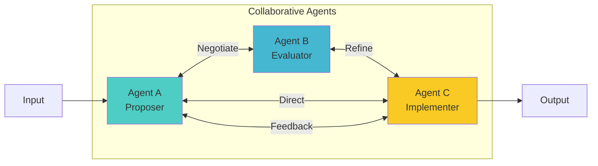
```mermaid
graph LR
    subgraph "Collaborative Agents"
        A[Agent A<br/>Proposer] <-->|Negotiate| B[Agent B<br/>Evaluator]
        B <-->|Refine| C[Agent C<br/>Implementer]
        C <-->|Feedback| A
        A <-->|Direct| C
    end

    INPUT[Input] --> A
    C --> OUTPUT[Output]

    style A fill:#4ecdc4
    style B fill:#45b7d1
    style C fill:#f9ca24
```

### 3. Pipeline Pattern

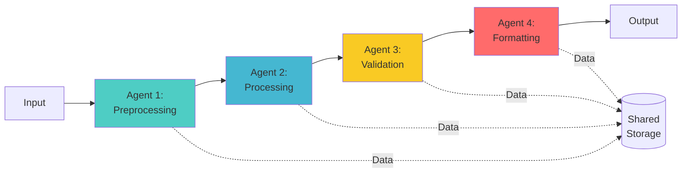
```mermaid
graph LR
    INPUT[Input] --> A1[Agent 1:<br/>Preprocessing]
    A1 --> A2[Agent 2:<br/>Processing]
    A2 --> A3[Agent 3:<br/>Validation]
    A3 --> A4[Agent 4:<br/>Formatting]
    A4 --> OUTPUT[Output]

    A1 -.->|Data| D[(Shared<br/>Storage)]
    A2 -.->|Data| D
    A3 -.->|Data| D
    A4 -.->|Data| D

    style A1 fill:#4ecdc4
    style A2 fill:#45b7d1
    style A3 fill:#f9ca24
    style A4 fill:#ff6b6b
```

## Communication Patterns

### Message-Based Communication

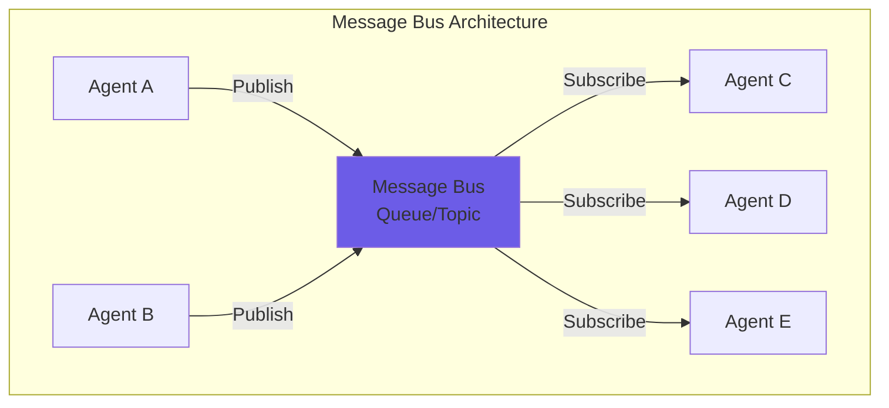
```mermaid
graph TB
    subgraph "Message Bus Architecture"
        SENDER1[Agent A] -->|Publish| BUS[Message Bus<br/>Queue/Topic]
        SENDER2[Agent B] -->|Publish| BUS

        BUS -->|Subscribe| RECEIVER1[Agent C]
        BUS -->|Subscribe| RECEIVER2[Agent D]
        BUS -->|Subscribe| RECEIVER3[Agent E]
    end

    style BUS fill:#6c5ce7
```

**Message Structure:**

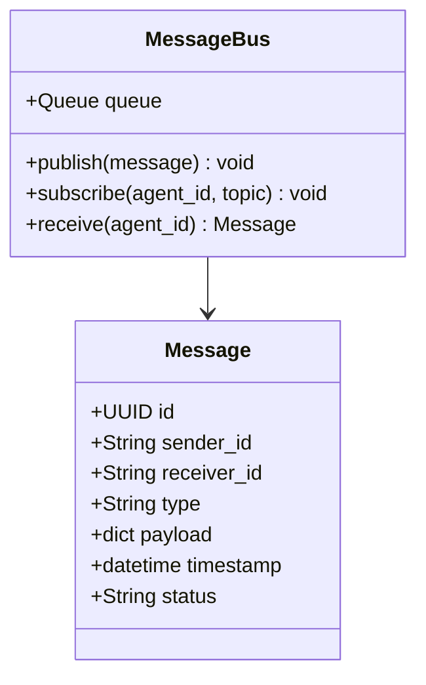
```mermaid
classDiagram
    class Message {
        +UUID id
        +String sender_id
        +String receiver_id
        +String type
        +dict payload
        +datetime timestamp
        +String status
    }

    class MessageBus {
        +Queue queue
        +publish(message) void
        +subscribe(agent_id, topic) void
        +receive(agent_id) Message
    }

    MessageBus --> Message
```

### Shared Memory Pattern

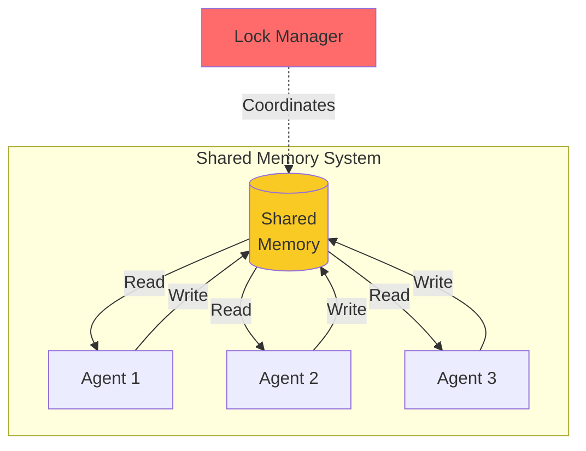
```mermaid
graph TB
    subgraph "Shared Memory System"
        MEM[(Shared<br/>Memory)]

        A1[Agent 1] -->|Write| MEM
        A2[Agent 2] -->|Write| MEM
        A3[Agent 3] -->|Write| MEM

        MEM -->|Read| A1
        MEM -->|Read| A2
        MEM -->|Read| A3
    end

    LOCK[Lock Manager] -.->|Coordinates| MEM

    style MEM fill:#f9ca24
    style LOCK fill:#ff6b6b
```

## Coordination Strategies

### Centralized Coordination

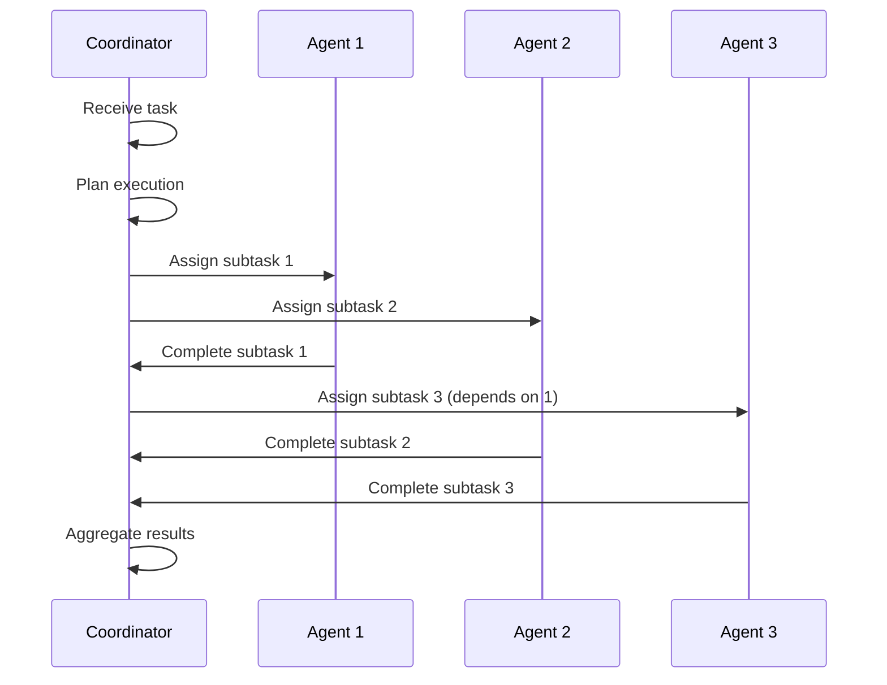
```mermaid
sequenceDiagram
    participant Coord as Coordinator
    participant A1 as Agent 1
    participant A2 as Agent 2
    participant A3 as Agent 3

    Coord->>Coord: Receive task
    Coord->>Coord: Plan execution
    Coord->>A1: Assign subtask 1
    Coord->>A2: Assign subtask 2

    A1->>Coord: Complete subtask 1
    Coord->>A3: Assign subtask 3 (depends on 1)

    A2->>Coord: Complete subtask 2
    A3->>Coord: Complete subtask 3

    Coord->>Coord: Aggregate results
```

### Decentralized Coordination

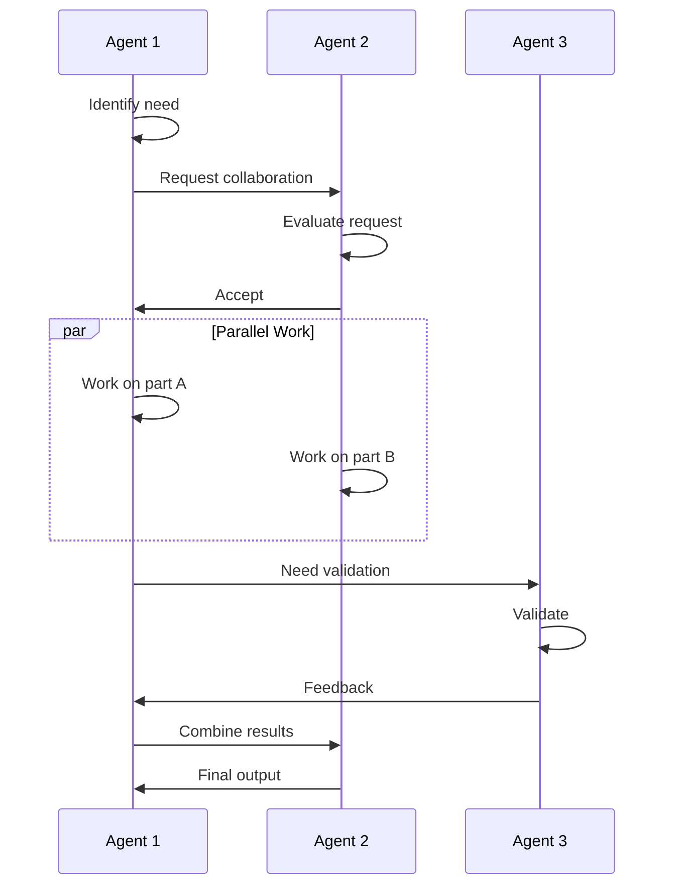
```mermaid
sequenceDiagram
    participant A1 as Agent 1
    participant A2 as Agent 2
    participant A3 as Agent 3

    A1->>A1: Identify need
    A1->>A2: Request collaboration
    A2->>A2: Evaluate request
    A2->>A1: Accept

    par Parallel Work
        A1->>A1: Work on part A
        A2->>A2: Work on part B
    end

    A1->>A3: Need validation
    A3->>A3: Validate
    A3->>A1: Feedback

    A1->>A2: Combine results
    A2->>A1: Final output
```

## Task Allocation

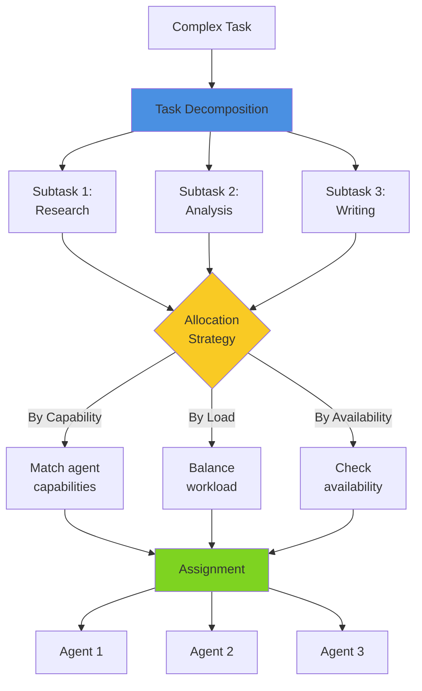
```mermaid
graph TB
    TASK[Complex Task] --> DECOMP[Task Decomposition]

    DECOMP --> ST1[Subtask 1:<br/>Research]
    DECOMP --> ST2[Subtask 2:<br/>Analysis]
    DECOMP --> ST3[Subtask 3:<br/>Writing]

    ST1 --> ALLOC{Allocation<br/>Strategy}
    ST2 --> ALLOC
    ST3 --> ALLOC

    ALLOC -->|By Capability| C[Match agent<br/>capabilities]
    ALLOC -->|By Load| L[Balance<br/>workload]
    ALLOC -->|By Availability| A[Check<br/>availability]

    C --> ASSIGN[Assignment]
    L --> ASSIGN
    A --> ASSIGN

    ASSIGN --> A1[Agent 1]
    ASSIGN --> A2[Agent 2]
    ASSIGN --> A3[Agent 3]

    style DECOMP fill:#4a90e2
    style ALLOC fill:#f9ca24
    style ASSIGN fill:#7ed321
```

## Conflict Resolution

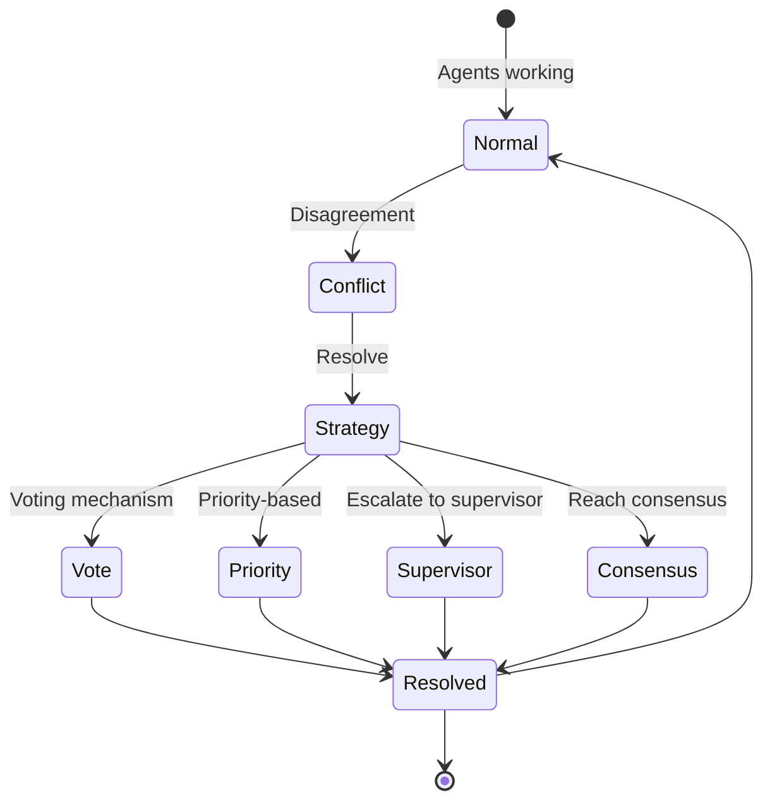
```mermaid
stateDiagram-v2
    [*] --> Normal: Agents working
    Normal --> Conflict: Disagreement
    Conflict --> Strategy: Resolve

    Strategy --> Vote: Voting mechanism
    Strategy --> Priority: Priority-based
    Strategy --> Supervisor: Escalate to supervisor
    Strategy --> Consensus: Reach consensus

    Vote --> Resolved
    Priority --> Resolved
    Supervisor --> Resolved
    Consensus --> Resolved

    Resolved --> Normal
    Resolved --> [*]
```

## Agent Collaboration Example

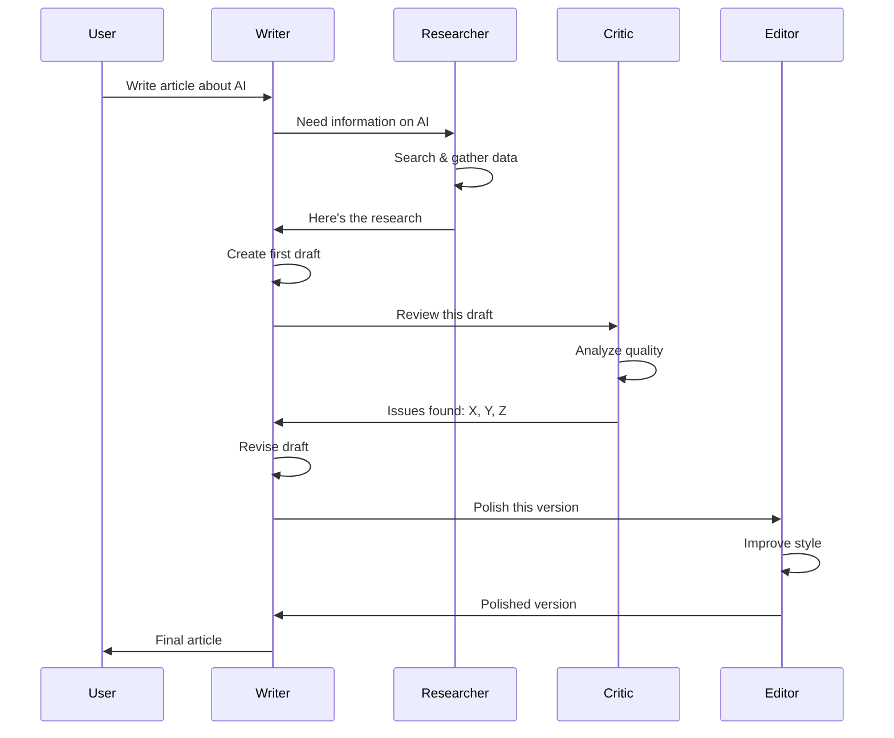
```mermaid
sequenceDiagram
    participant User
    participant Writer
    participant Researcher
    participant Critic
    participant Editor

    User->>Writer: Write article about AI
    Writer->>Researcher: Need information on AI
    Researcher->>Researcher: Search & gather data
    Researcher->>Writer: Here's the research

    Writer->>Writer: Create first draft
    Writer->>Critic: Review this draft
    Critic->>Critic: Analyze quality
    Critic->>Writer: Issues found: X, Y, Z

    Writer->>Writer: Revise draft
    Writer->>Editor: Polish this version
    Editor->>Editor: Improve style
    Editor->>Writer: Polished version

    Writer->>User: Final article
```

## Load Balancing

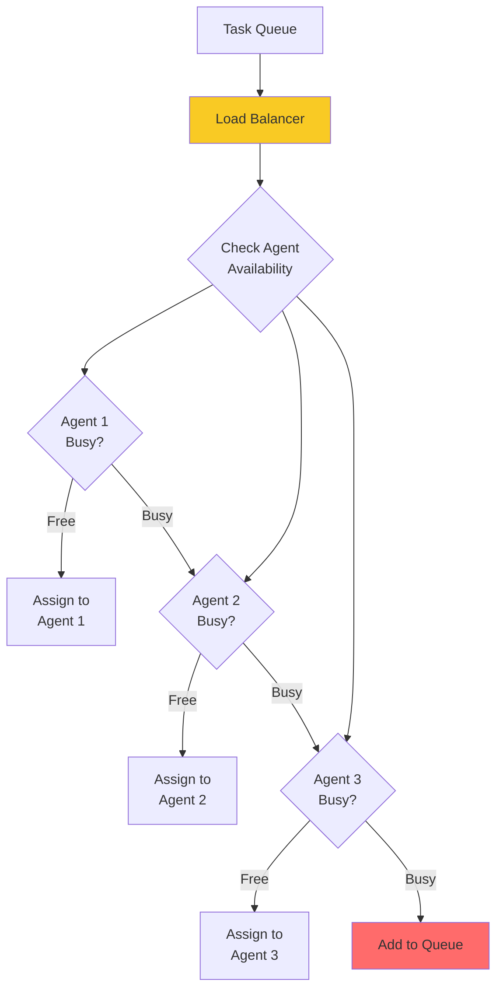
```mermaid
graph TB
    TASKS[Task Queue] --> LB[Load Balancer]

    LB --> CHECK{Check Agent<br/>Availability}

    CHECK --> A1STATUS{Agent 1<br/>Busy?}
    CHECK --> A2STATUS{Agent 2<br/>Busy?}
    CHECK --> A3STATUS{Agent 3<br/>Busy?}

    A1STATUS -->|Free| A1[Assign to<br/>Agent 1]
    A2STATUS -->|Free| A2[Assign to<br/>Agent 2]
    A3STATUS -->|Free| A3[Assign to<br/>Agent 3]

    A1STATUS -->|Busy| A2STATUS
    A2STATUS -->|Busy| A3STATUS
    A3STATUS -->|Busy| QUEUE[Add to Queue]

    style LB fill:#f9ca24
    style QUEUE fill:#ff6b6b
```

## Scalability Architecture

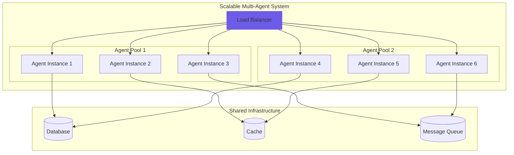
```mermaid
graph TB
    subgraph "Scalable Multi-Agent System"
        direction TB

        LB[Load Balancer]

        subgraph "Agent Pool 1"
            A1[Agent Instance 1]
            A2[Agent Instance 2]
            A3[Agent Instance 3]
        end

        subgraph "Agent Pool 2"
            A4[Agent Instance 4]
            A5[Agent Instance 5]
            A6[Agent Instance 6]
        end

        LB --> A1
        LB --> A2
        LB --> A3
        LB --> A4
        LB --> A5
        LB --> A6
    end

    subgraph "Shared Infrastructure"
        DB[(Database)]
        CACHE[(Cache)]
        QUEUE[(Message Queue)]
    end

    A1 --> DB
    A2 --> CACHE
    A3 --> QUEUE
    A4 --> DB
    A5 --> CACHE
    A6 --> QUEUE

    style LB fill:#6c5ce7
```

## Monitoring Multi-Agent Systems

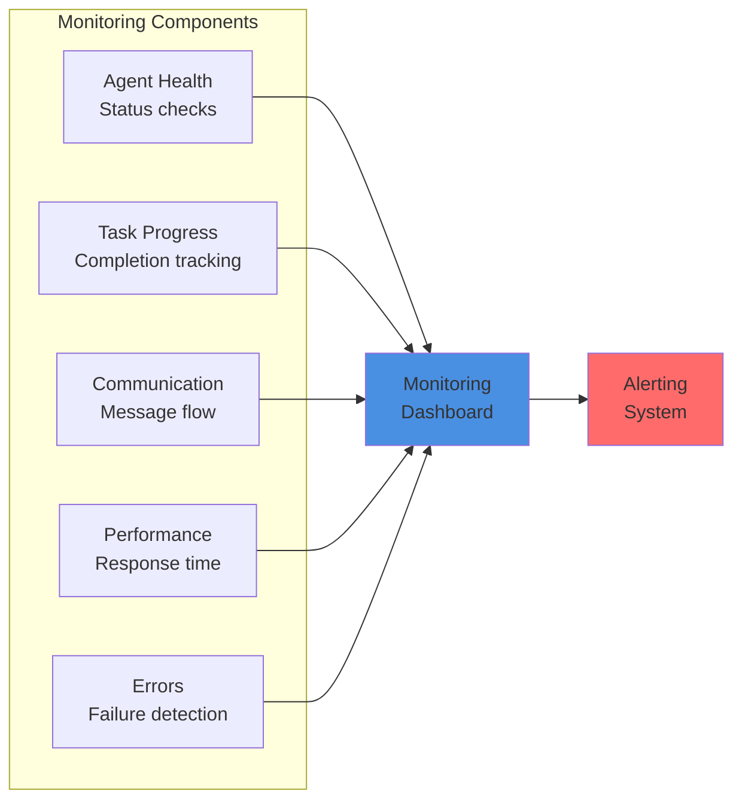
```mermaid
graph LR
    subgraph "Monitoring Components"
        M1[Agent Health<br/>Status checks]
        M2[Task Progress<br/>Completion tracking]
        M3[Communication<br/>Message flow]
        M4[Performance<br/>Response time]
        M5[Errors<br/>Failure detection]
    end

    M1 --> DASHBOARD[Monitoring<br/>Dashboard]
    M2 --> DASHBOARD
    M3 --> DASHBOARD
    M4 --> DASHBOARD
    M5 --> DASHBOARD

    DASHBOARD --> ALERT[Alerting<br/>System]

    style DASHBOARD fill:#4a90e2
    style ALERT fill:#ff6b6b
```

## Related Topics

- **Day 1**: Agent fundamentals (single agent)
- **Day 6**: Agent patterns (individual patterns)
- **Day 16**: Communication patterns (detailed)
- **Day 17**: Orchestration frameworks (implementation)
- **Day 21**: Multi-agent project (practical application)

## Multi-Agent Design Patterns

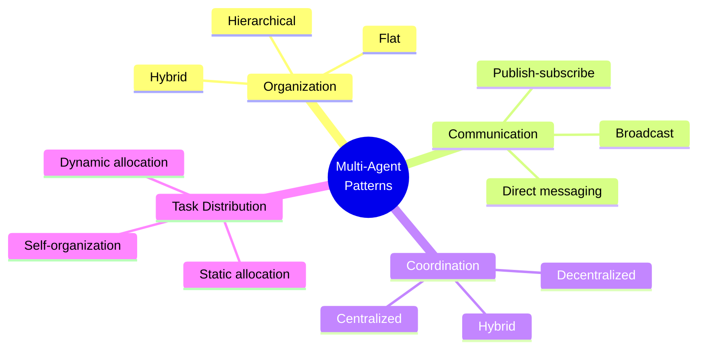
```mermaid
mindmap
    root((Multi-Agent<br/>Patterns))
        Organization
            Hierarchical
            Flat
            Hybrid
        Communication
            Direct messaging
            Broadcast
            Publish-subscribe
        Coordination
            Centralized
            Decentralized
            Hybrid
        Task Distribution
            Static allocation
            Dynamic allocation
            Self-organization
```

## Failure Handling

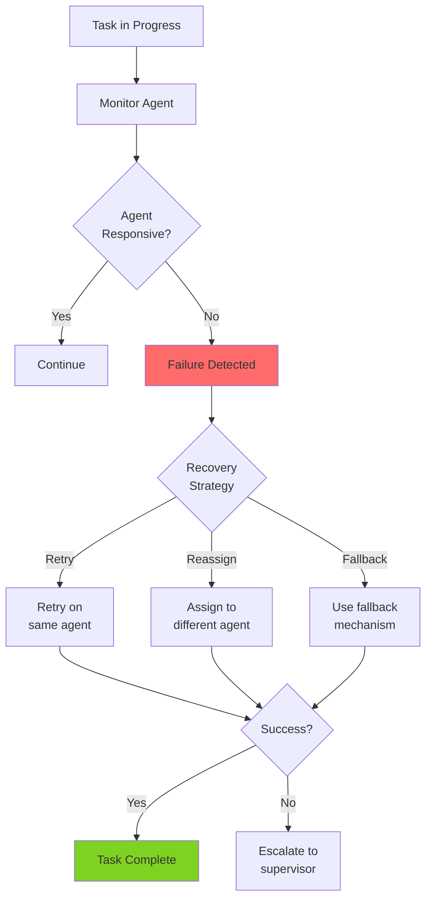
```mermaid
graph TB
    TASK[Task in Progress] --> MONITOR[Monitor Agent]

    MONITOR --> CHECK{Agent<br/>Responsive?}

    CHECK -->|Yes| CONTINUE[Continue]
    CHECK -->|No| DETECT[Failure Detected]

    DETECT --> STRATEGY{Recovery<br/>Strategy}

    STRATEGY -->|Retry| RETRY[Retry on<br/>same agent]
    STRATEGY -->|Reassign| REASSIGN[Assign to<br/>different agent]
    STRATEGY -->|Fallback| FALLBACK[Use fallback<br/>mechanism]

    RETRY --> SUCCESS{Success?}
    REASSIGN --> SUCCESS
    FALLBACK --> SUCCESS

    SUCCESS -->|Yes| COMPLETE[Task Complete]
    SUCCESS -->|No| ESCALATE[Escalate to<br/>supervisor]

    style DETECT fill:#ff6b6b
    style COMPLETE fill:#7ed321
```

---

**Related Days**: [Day 6](./day-06-agent-patterns.md) | [Day 16](./day-16-communication.md) | [Day 17](./day-17-orchestration.md)
