# Day 22: Production Deployment Architecture

## Deployment Architecture Overview

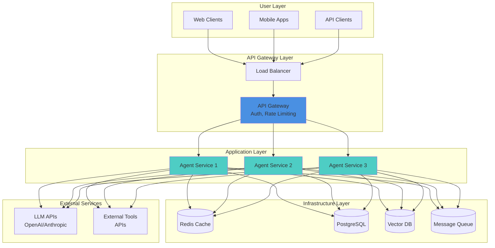

## FastAPI Service Architecture

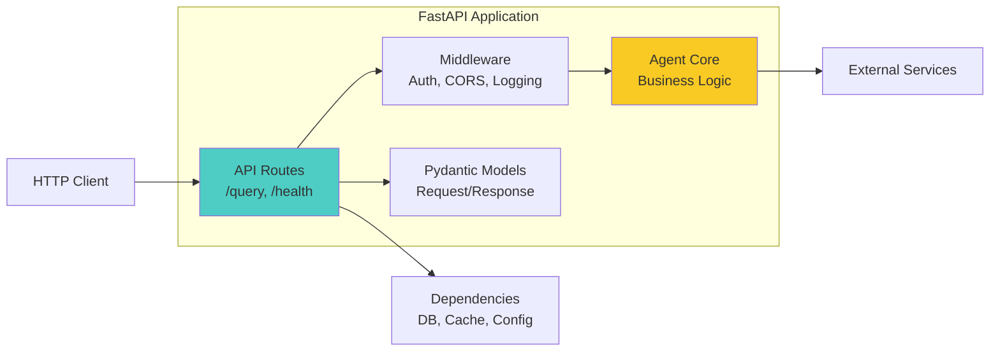

**FastAPI Endpoint Structure:**

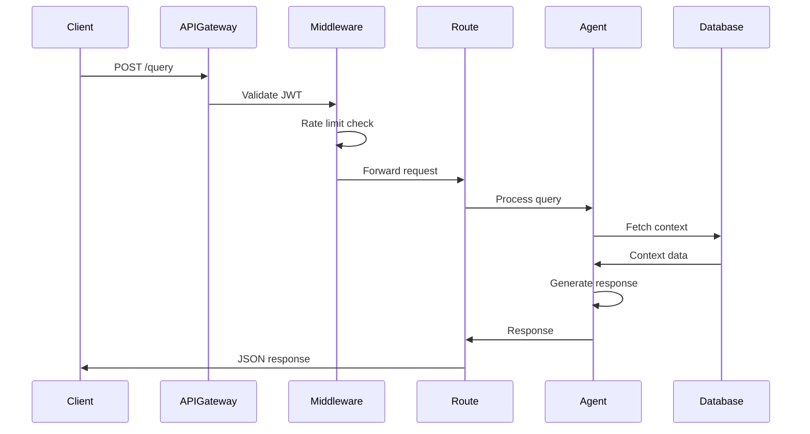

## Docker Deployment

```mermaid
graph TB
    subgraph "Docker Architecture"
        direction LR

        subgraph "Container 1"
            APP1[Agent App<br/>Python + FastAPI]
        end

        subgraph "Container 2"
            APP2[Agent App<br/>(Replica)]
        end

        subgraph "Container 3"
            DB[PostgreSQL<br/>Database]
        end

        subgraph "Container 4"
            REDIS[Redis<br/>Cache]
        end

        subgraph "Container 5"
            VECTOR[Qdrant<br/>Vector DB]
        end
    end

    NETWORK[Docker Network] -.-> APP1
    NETWORK -.-> APP2
    NETWORK -.-> DB
    NETWORK -.-> REDIS
    NETWORK -.-> VECTOR

    VOLUMES[(Docker Volumes)] -.-> DB
    VOLUMES -.-> VECTOR

    style APP1 fill:#4ecdc4
    style APP2 fill:#4ecdc4
    style NETWORK fill:#f9ca24
```

**Docker Compose Structure:**

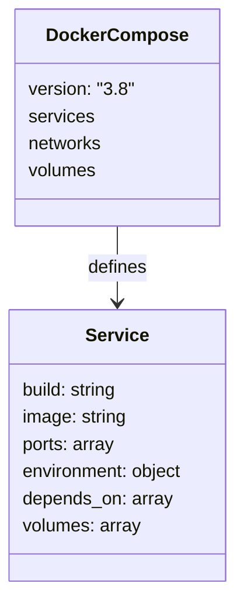

## Kubernetes Deployment

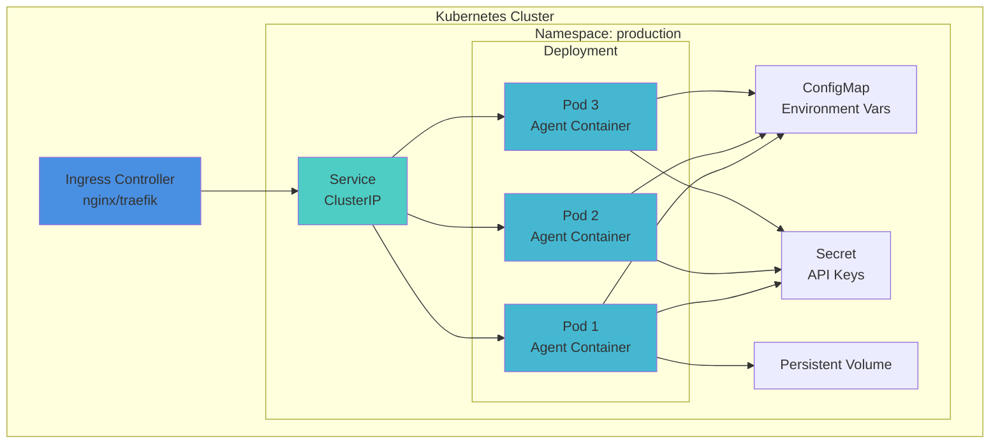

## Auto-Scaling Architecture

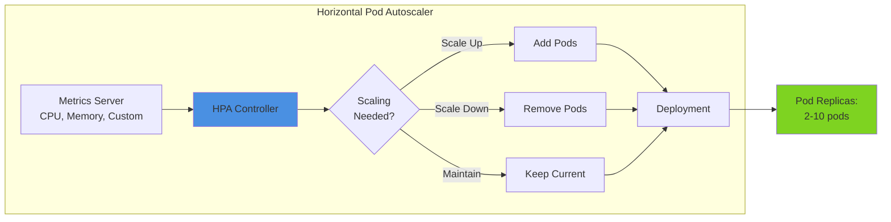

## Cloud Deployment Options

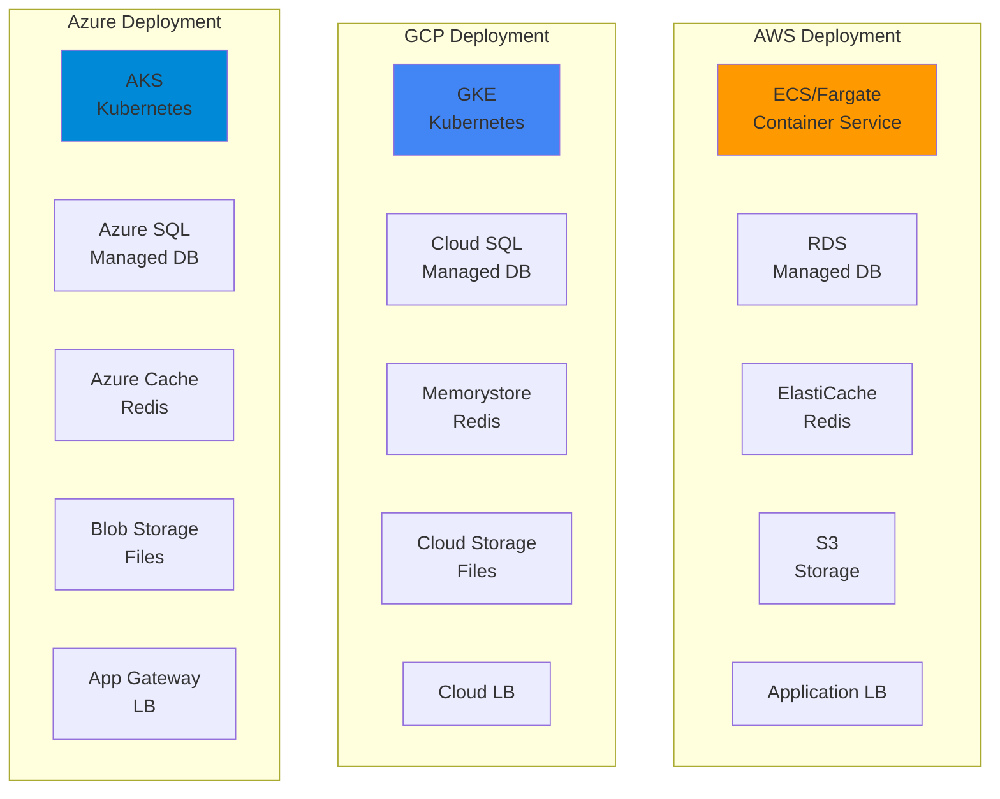

## Serverless Architecture

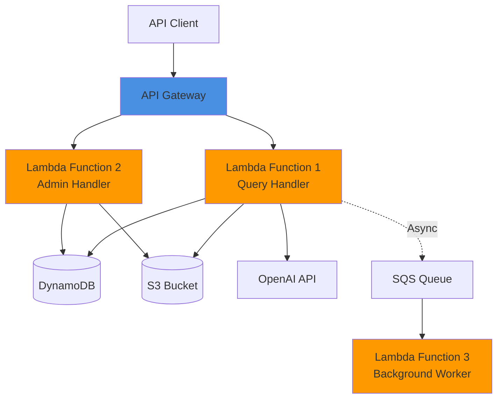

## CI/CD Pipeline

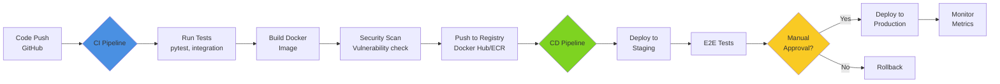

## Blue-Green Deployment

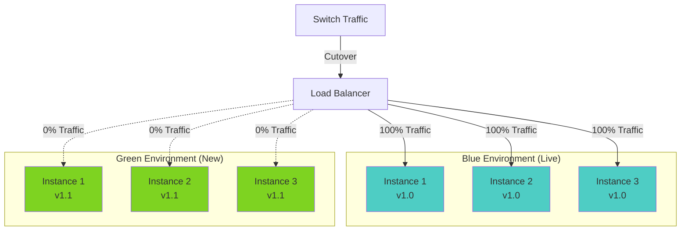

## Secrets Management

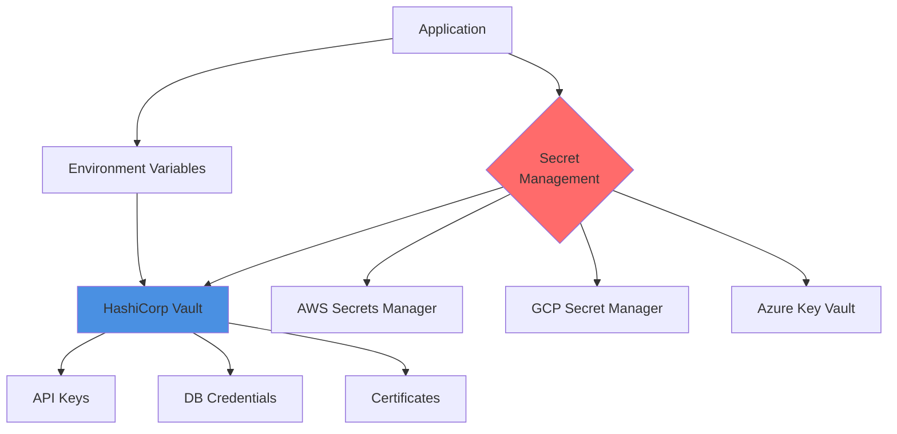

## Health Checks & Monitoring

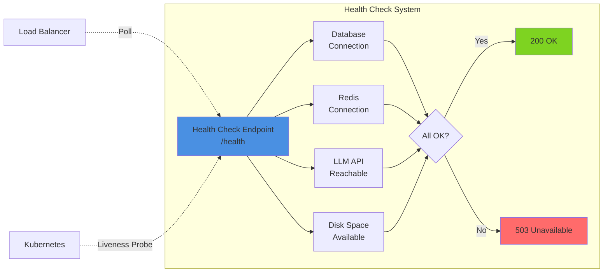

## Monitoring Stack

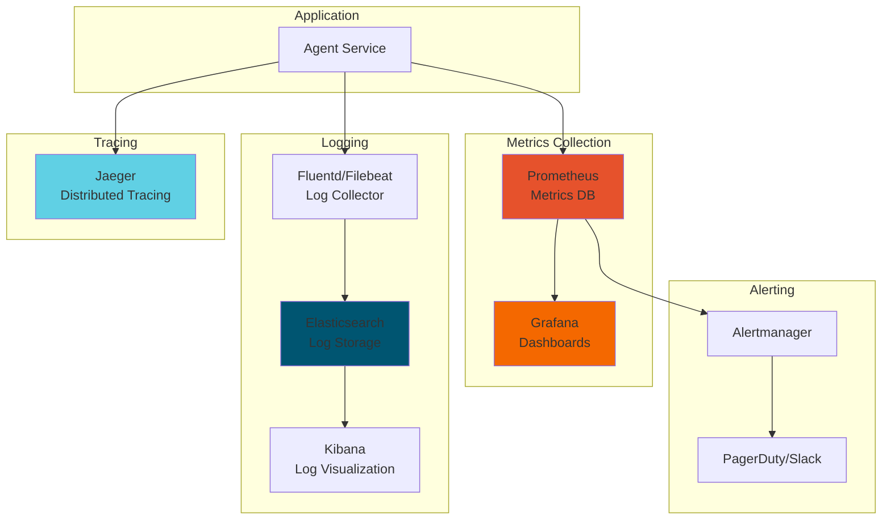

## Disaster Recovery

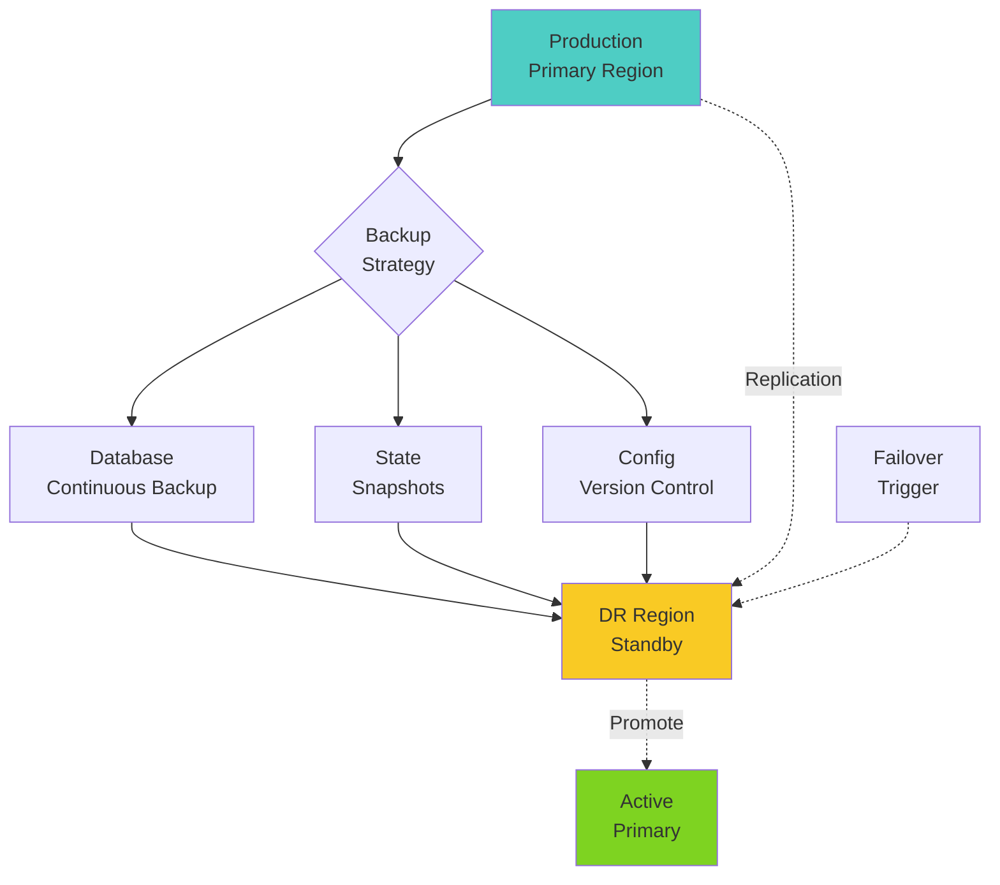

## Related Topics

- **Day 1**: Agent fundamentals (what we're deploying)
- **Day 23**: Monitoring & Observability (detailed monitoring)
- **Day 24**: Cost Optimization (cost-effective deployment)
- **Day 25**: Security (deployment security)

## Deployment Checklist

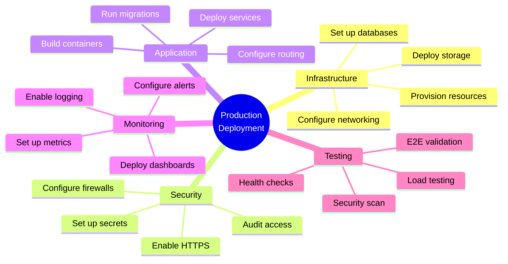

---

**Related Days**: [Day 23](./day-23-monitoring.md) | [Day 24](./day-24-optimization.md) | [Day 25](./day-25-security.md)
